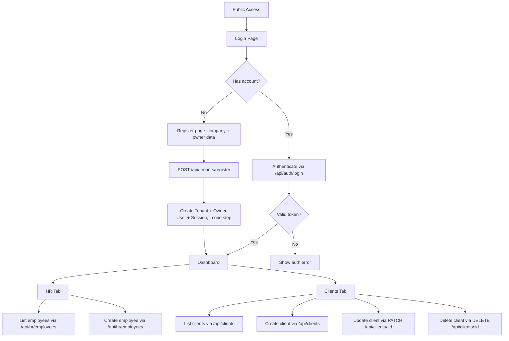
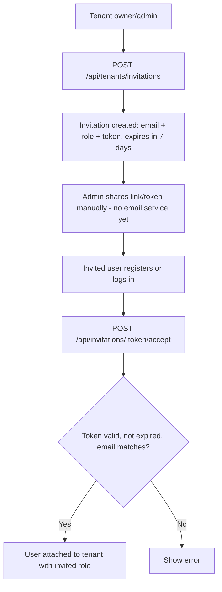
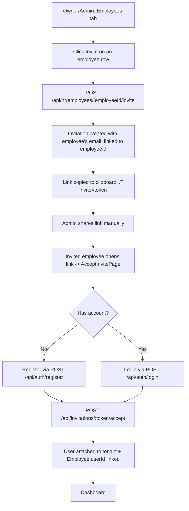
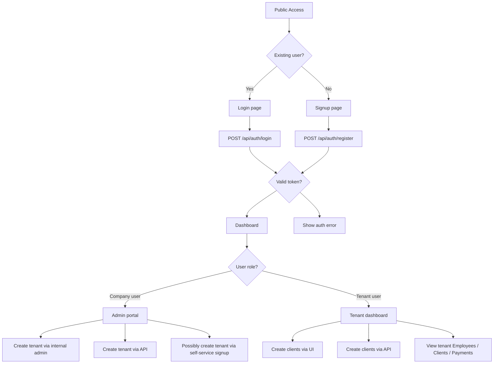

# Current Process Flow

- Última actualización: 2026-07-10 (se agregó el flujo de invitar empleados a tener acceso propio, y la pantalla de aceptar invitación que faltaba)

This document describes the current onboarding and application flow for Northstack.

## Public access flow

## Key points

- Registration is a **single step**: the Register page asks for company (tenant) data and owner user data together, and `POST /api/tenants/register` creates the Tenant + owner User + Session atomically. This avoids ever creating a "tenant-less" user outside of the invitation flow (see below).
- `POST /api/auth/register` (bare user, no tenant) still exists for the invitation-acceptance path: someone accepting an invite who doesn't have an account yet registers first, then accepts.
- After registering, the user lands directly in the dashboard.
- The dashboard currently supports:
  - employee listing and creation
  - client listing, creation, update and deletion
  - custom fields for both employees and clients

## Invitation flow (new, 2026-07-06)

The open `POST /api/tenants/join` (any authenticated user could attach to any tenant just by knowing its `tenantId`) was removed as an insecure pattern. It's replaced by an invitation flow:

- Sending the invitation is manual for now (no email provider integrated) — flagged as a future improvement, evaluated and deliberately postponed.
- Now exposed in the frontend, both for tenant-level invitations and employee invitations (see below).

## Employee self-access flow (new, 2026-07-10)

`Employee` can optionally link to a `User` via `Employee.userId` (nullable, unique) — a link, not a merge of the two entities. An owner/admin can generate an invitation for a specific employee:

- The app has no router library — `?invite=token` is parsed manually in `App.tsx` to avoid adding a dependency for a single route.
- `AcceptInvitePage` never reuses a stored session token, since the person opening the link may not be whoever last used that browser.
- The Employees table shows "Invite" for unlinked employees and "Linked" once `Employee.userId` is set.

## Frontend implementation status

- `frontend/` (Vite + React) implements this flow: `LoginPage`, `RegisterPage` (company + owner data in one form), `DashboardPage`, `AcceptInvitePage`.
- `CreateTenantPage` was removed — it was dead code built against the deleted `createTenantWithOwner` shape and was never wired into `App.tsx`.
- Verified end-to-end via `curl` against the running backend (`POST /api/tenants/register`, and the full invite → register → accept → `Employee.userId` linked flow); not yet clicked through in an actual browser session.
- `frontend/tsconfig.json` is missing `jsx` config, so `npm run build` fails for the frontend (pre-existing, doesn't affect the Vite dev server).

## Current UI behavior

- Public login page:
  - `Login`
  - `Register` (company + owner data)
- Dashboard:
  - `Employees` tab
  - `Clients` tab

## Proposed controlled onboarding

This model separates the public flow into two branches:
- **Signup branch** for new accounts
- **Login branch** for returning users

Tenant creation can occur through multiple channels:
- self-service signup by the client
- internal onboarding by our company users
- API-driven onboarding from an external integration

Clients created under a tenant can also be added:
- through the tenant UI
- through an API integration

The system must distinguish between two user roles:
- **Company user:** internal staff / admins who can create tenants, manage onboarding, and control tenant setup.
- **Tenant user:** regular client users who belong to an existing tenant and manage tenant-level data.

### Proposed process flow

## Why this change matters

- it makes signup and login behavior explicit and separate
- it supports tenant creation by the client, by our team, or by an API
- it supports tenant client creation through both UI and API
- it keeps role-based access clear for company users vs tenant users

## Future roadmap note

- later, the public signup branch can evolve into a dedicated free/subscription account flow
- tenant creation should still be managed through controlled onramps, with self-service as a supported channel when desired
