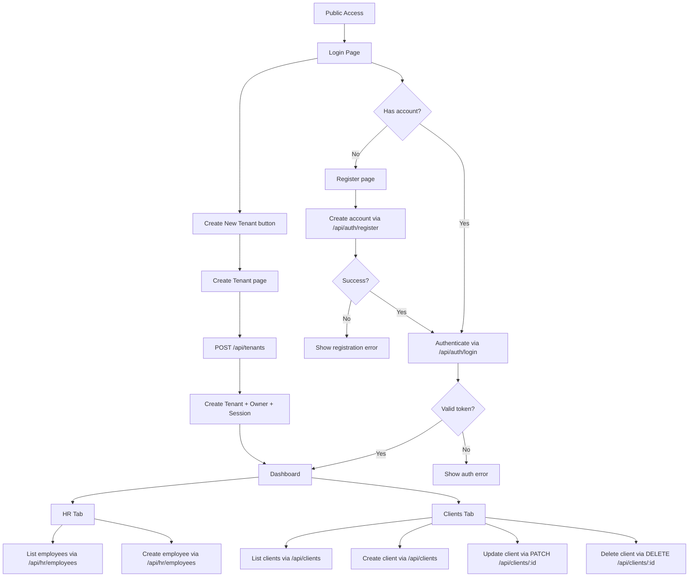
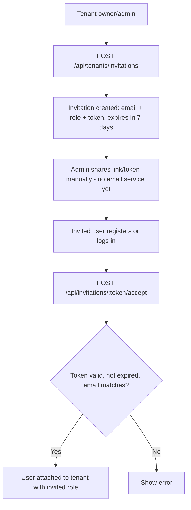
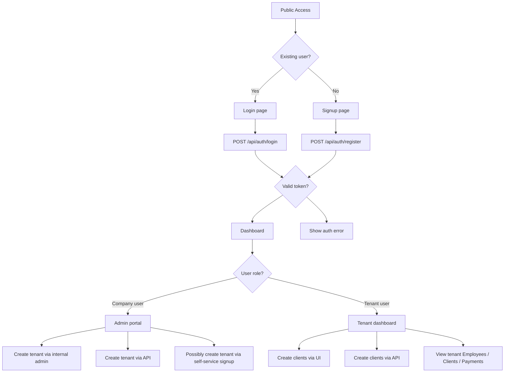

# Current Process Flow

- Última actualización: 2026-07-06

This document describes the current onboarding and application flow for Northstack.

## Public access flow

## Key points

- `Create New Tenant` is currently available from the public login screen.
- Tenant creation performs:
  - tenant creation
  - owner user creation
  - session creation
- After creating a tenant, the user lands directly in the dashboard.
- The dashboard currently supports:
  - employee listing and creation
  - client listing, creation, update and deletion
  - custom fields for both employees and clients

## Invitation flow (new, 2026-07-06)

The open `POST /api/tenants/join` (any authenticated user could attach to any tenant just by knowing its `tenantId`) was removed as an insecure pattern. It's replaced by an invitation flow:

- Sending the invitation is manual for now (no email provider integrated) — flagged as a future improvement, evaluated and deliberately postponed.
- Not yet exposed in the frontend (backend-only so far).

## Frontend implementation status

- `frontend/` (Vite + React) implements this flow: `LoginPage`, `RegisterPage`, `CreateTenantPage`, `DashboardPage`.
- Not yet browser-tested end-to-end as part of this doc update — pending a follow-up session.

## Current UI behavior

- Public login page:
  - `Login`
  - `Register`
  - `Create New Tenant`
- Dashboard:
  - `Employees` tab
  - `Clients` tab

## Proposed controlled onboarding

This model separates the public flow into two branches:
- **Signup branch** for new accounts
- **Login branch** for returning users

Tenant creation can occur through multiple channels:
- self-service signup by the client
- internal onboarding by our company users
- API-driven onboarding from an external integration

Clients created under a tenant can also be added:
- through the tenant UI
- through an API integration

The system must distinguish between two user roles:
- **Company user:** internal staff / admins who can create tenants, manage onboarding, and control tenant setup.
- **Tenant user:** regular client users who belong to an existing tenant and manage tenant-level data.

### Proposed process flow

## Why this change matters

- it makes signup and login behavior explicit and separate
- it supports tenant creation by the client, by our team, or by an API
- it supports tenant client creation through both UI and API
- it keeps role-based access clear for company users vs tenant users

## Future roadmap note

- later, the public signup branch can evolve into a dedicated free/subscription account flow
- tenant creation should still be managed through controlled onramps, with self-service as a supported channel when desired
