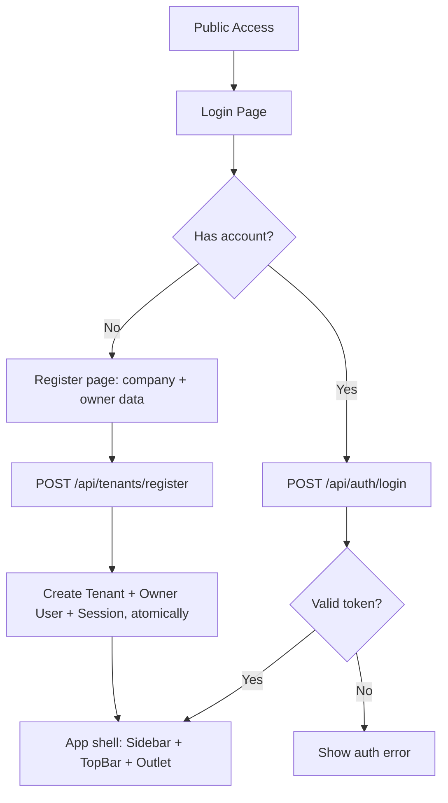
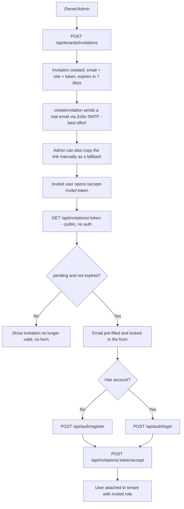
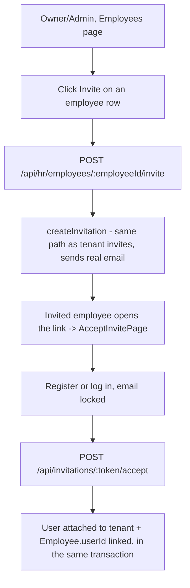
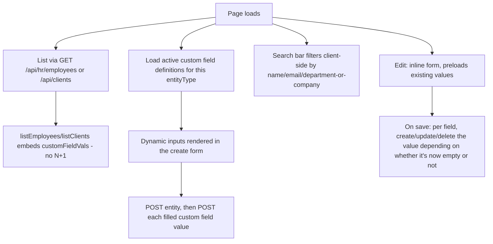
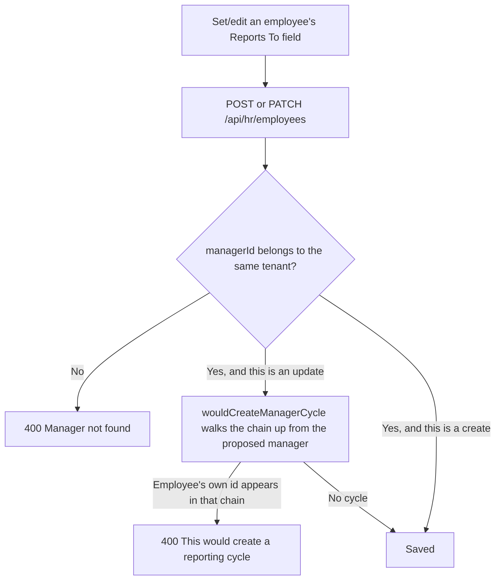
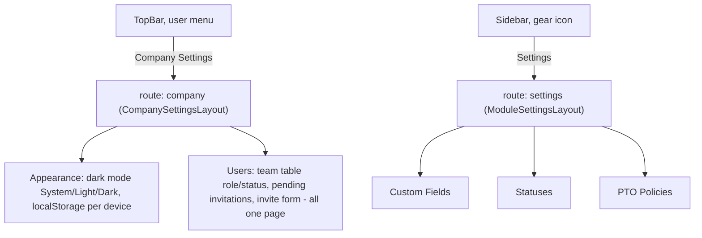
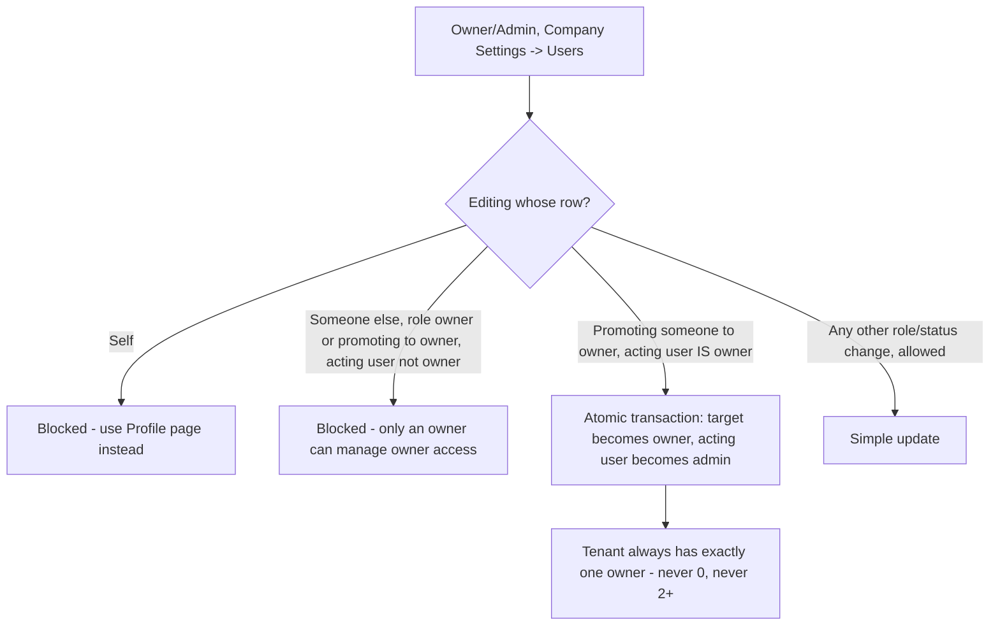
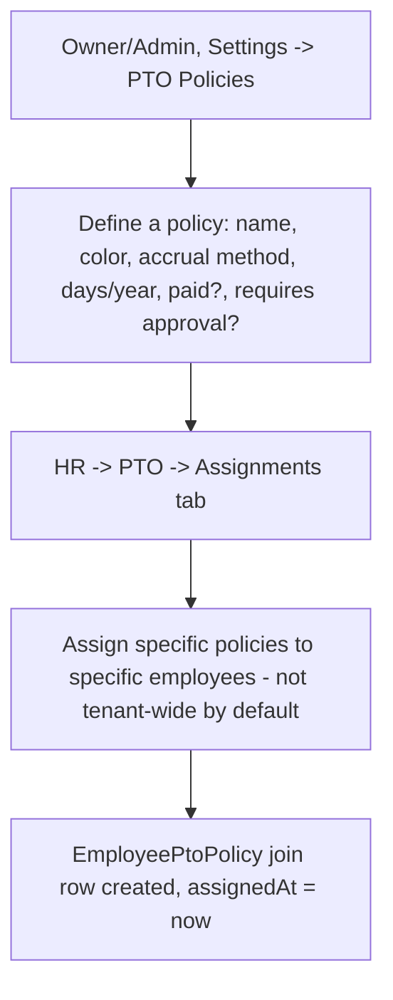
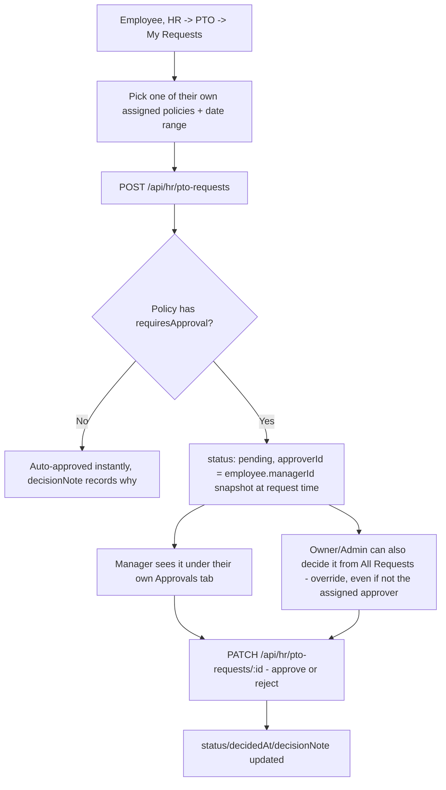
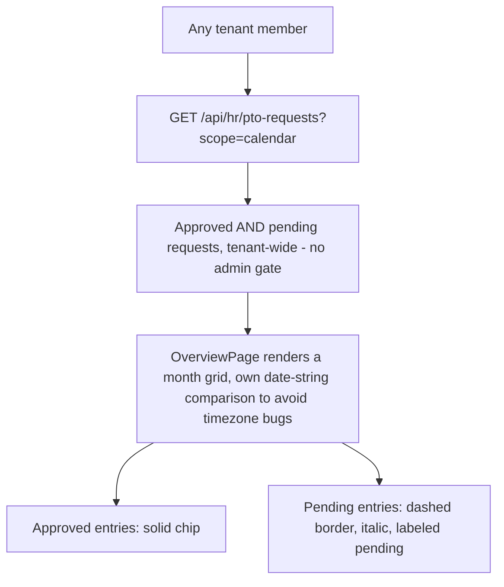

# Current Process Flow

- Última actualización: 2026-07-14 (sistema de PTO completo, landing en su propia branch, Overview como pantalla de inicio)

This document describes the current architecture and flows for Northstack, kept in sync so a fresh session (or a fresh person) can recover context quickly.

## Where the app lives

- **Frontend**: React + Vite (`frontend/`), served as a static build.
- **Backend**: Express (`src/app.ts`), split so it can run two ways:
  - Locally: `src/server.ts` imports the app and calls `.listen()` (`npm run dev`, `tsx watch`).
  - Production: `api/index.ts` exports the same Express app for Vercel's serverless Node runtime — no `.listen()`, each request is an isolated invocation.
- **Database**: Neon (serverless Postgres) via Prisma, same `DATABASE_URL` in both environments.
- **Hosting**: Vercel, one project (`northstack`) serving both the static frontend and the `/api/*` + `/health` serverless function (`vercel.json` routes accordingly; `framework: null` so Vercel doesn't auto-detect "Express" and break the hybrid build).
- **Deploys**: every push to `main` on GitHub triggers `.github/workflows/deploy.yml`, which runs `vercel deploy --prod` using a `VERCEL_TOKEN` repo secret (Vercel's native GitHub App integration couldn't be authorized headlessly, so this is the workaround).
- **Domain**: `joinnorthstack.com` (Cloudflare Registrar), split across **two separate Vercel projects**, both on the same account:
  - `app.joinnorthstack.com` (A record → `76.76.21.21`, DNS only/no proxy) → the `northstack` project (the real app, static frontend + serverless backend).
  - `joinnorthstack.com` root (A record → `76.76.21.21`, same IP, different Vercel-side routing) → the `northstack-landing` project — a static marketing page (`landing/index.html`), no backend, no sign up/login yet (deliberately left out until the beta is live).
  - Both get SSL issued automatically by Vercel (Let's Encrypt, zero manual steps). The root domain's DNS is also where the email records live (see below).
- **Two branches, two independent deploy pipelines** (split 2026-07-14, at the user's request, to stop mixing landing work with app work in the same branch): `landing/` no longer exists on `main` at all.
  - `main` → `.github/workflows/deploy.yml` has a single `deploy-app` job, triggered by pushes to `main`, deploying the `northstack` Vercel project.
  - `landing` branch → its own `.github/workflows/deploy.yml` (different content than the one on `main` — branches diverge on this file on purpose) with a single `deploy-landing` job, triggered by pushes to `landing`, deploying the `northstack-landing` Vercel project.
  - Both still use `vercel deploy --prod` directly (not Vercel's native Git integration), so there's no "Production Branch" setting to keep in sync — moving the trigger was just a matter of editing each branch's own workflow file.
- **Email**: `joinnorthstack.com`'s MX/SPF/DKIM point to Zoho Mail (free tier). The backend sends real transactional email via SMTP (`smtp.zoho.com:465`) from `no.reply@joinnorthstack.com`, using `nodemailer` (`src/lib/mailer.ts`).

## Backend resilience

- Express 4 doesn't catch rejected promises from `async` route handlers — an uncaught one used to crash the whole local dev process (this is literally what caused an outage mid-session: `npm run dev` died and nothing restarted it). Fixed by wrapping `app.get/post/patch/delete/put` once in `app.ts` so any thrown error reaches a catch-all error-handling middleware that returns a clean `{error: "..."}` 500 instead of dying. The wrapper is defensive about `app.get`'s dual use (route registration vs. Express's internal settings-getter, e.g. `app.get('etag')`) — only wraps calls shaped like `(path: string, handler: function)`.
- `src/lib/prisma.ts` wraps the Prisma client with `$extends` to retry connection-level failures (Neon can be slow to wake from idle) up to twice with backoff, before giving up. Non-connection errors (e.g. unique constraint violations) fail immediately, no retry.
- `frontend/src/api.ts`'s `apiFetch` wrapper catches the network-level error `fetch()` throws when the backend is unreachable, and turns it into a readable `ApiError` message instead of a raw "Failed to fetch".

## Auth & registration flow

- Registration is a **single step**: company data + owner data together, `POST /api/tenants/register` creates Tenant + owner User + Session atomically — never a "tenant-less" user outside the invitation path.
- `POST /api/auth/register` (bare user, no tenant) exists only for the invitation-acceptance path.
- Every endpoint that returns a `user` object strips `passwordHash` first (`sanitizeUser` in `authService.ts`) — this used to leak to the client on every auth response until it was found and fixed.

## Invitation flow (email-backed, real send)

- Real email sending: `createInvitation` (`tenantService.ts`) calls `sendInvitationEmail` (`src/lib/mailer.ts`) after creating the invitation row. It's **best-effort** — a failed send doesn't fail the request, since the copyable link in the UI still works as a fallback.
- The accept page fetches the invitation's email/role/status *before* showing the form (`GET /api/invitations/:token`, public), so the email field comes pre-filled and disabled instead of being freely editable, and dead invitations show an error instead of a form nobody can submit successfully.
- This same `createInvitation` function backs **both** the generic tenant invite (Company Settings → Users → "Invite someone") and the per-employee invite (Employees table → "Invite" button) — one code path, one email template.

## Employee self-access flow

- `Employee` optionally links to a `User` via `Employee.userId` (nullable, unique) — a link, not a merge of the two entities.
- The Employees table shows "Invite" for unlinked employees, "Linked" once `Employee.userId` is set.

## HR and Clients modules (parity)

Both modules follow the same pattern end to end:

- Custom fields are generic across modules: `CustomFieldValue` has `tenantId` + `entityType` (`employee`/`client`) + `entityId`, no per-module foreign key — adding a future module (e.g. Payments) never requires a schema change here.
- Every custom-field-value endpoint verifies the definition belongs to the right `entityType` before accepting a value (prevents using an Employee field to store a Client value via direct API calls).
- Statuses are no longer fixed enums — `Employee.statusId`/`Client.statusId` are FKs to a per-tenant, per-module `StatusDefinition` catalog (name, color, order, isDefault, isActive), managed from `/settings` → Statuses. Every tenant gets sensible defaults seeded on creation (Employee: Active/Inactive/Pending — Client: Prospect/Active/Inactive/Archived), but can add/rename/reorder/deactivate freely from there; don't assume any fixed set of status names in code. Every status change is recorded in `StatusHistoryEntry` (snapshotted status names, not live FKs, so a later rename doesn't rewrite old history) — captured today, no UI to view it yet.
- `Employee.managerId` is a self-referential FK ("reports to") — see the org hierarchy flow below. Every tenant's owner also gets an auto-created `Employee` record on signup (`department: "Leadership"`) so they always appear as a manager option, even before adding any real employees; a one-off `scripts/backfill-owner-employees.ts` did the same for the ~30 pre-existing production tenants.

## Employee hierarchy (org chart)

- Covers both direct self-reporting (`employeeId === proposedManagerId`) and indirect cycles (A reports to B, B reports to A) via the same walk-up-the-chain check.
- This hierarchy is the routing backbone for PTO approvals (below) — a manager here is whoever an employee's requests get routed to by default.

## Settings navigation — two independent hubs

This went through three iterations before settling; the current shape is deliberate:

- **No cross-navigation** between the two hubs — none of Custom Fields/Statuses/PTO Policies are reachable from Company Settings, and Users/Appearance are not reachable from the sidebar's Settings. This was an explicit correction after an earlier round accidentally merged everything into one shared tabbed page.
- Each hub has its own internal sub-navigation (`.settings-shell`/`.settings-nav`/`.settings-content` in `App.css`) — a left-hand category list, content on the right — built to be extensible (e.g. Company Settings could later grow a "Subscriptions" category once billing exists). `/settings` went from 1 category (Custom Fields) to 3 (Statuses, then PTO Policies) without any structural rework, confirming the layout was actually built extensible and not just described that way.
- Both Statuses and PTO Policies use a shared `ColorPicker` component (`frontend/src/components/ColorPicker.tsx`) instead of a bare `<input type="color">` — preset swatches (brand colors + a general palette) plus a popover for custom colors, which get saved to `localStorage` (key `northstack:customColors`) and become available across every picker in the app, not just the one that added them.
- `Profile` (edit own name/phone/password) is a separate top-level route (`/profile`), reachable from the same TopBar user menu, since it's personal, not administrative — visible to every role, unlike Company Settings/module Settings which only show for owner/admin.

## Company/Users management — ownership is unique by construction

- Admin can freely edit roles/status for members and other admins — only touching the `owner` role (either target or destination) requires being an owner yourself.
- Promoting someone to owner is a **transfer**, not an addition: it happens in a single Prisma transaction that also demotes the acting owner to admin, so the tenant can never end up with zero or multiple owners — this replaced an earlier version where an owner could promote a second owner without losing their own role.

## PTO / vacation system

Built piece by piece over 2026-07-14, at the user's explicit request ("arranca con eso nomás"), each piece confirmed and pushed separately. 6 of 7 planned pieces are done — see `docs/database-schema.md` for the underlying tables and `docs/tareas-desarrollo.md` for the full dated build log. The one remaining piece (a non-status-changing visual tag on an employee's row while they're on active leave) isn't started.

### Policy setup and per-employee assignment

- `PtoPolicyDefinition.accrualMethod` supports two modes: `fixed_annual` (the full `daysPerYear` is available immediately) and `monthly` (accrues `daysPerYear / 12` per completed calendar month since `assignedAt`, capped at the annual total — the month a policy is assigned already counts, so nobody sees "0 days" on day one).
- A policy isn't automatically available to everyone — it has to be explicitly assigned per employee, which is what makes different day counts per seniority/contract type possible without needing multiple near-duplicate policies.

### Request + approval, routed by hierarchy

- `approverId` is fixed at creation time from the employee's current `managerId` — it does not get recalculated if the org chart changes afterward.
- If an employee has no manager set, `approverId` stays `null` and the request only shows up for owner/admin to decide (no manager-specific "Approvals" tab entry for anyone).
- A requester can cancel their own request while it's still `pending` (`DELETE /api/hr/pto-requests/:id`); once decided, cancellation isn't allowed — only future pieces (or manual DB access) can undo an approved/rejected request.

### Balance (derived, not stored)

- No new table — `ptoBalanceService.ts` computes `allocated`/`used`/`pending`/`remaining` on every request by combining `EmployeePtoPolicy.assignedAt`, the policy's accrual settings, and the sum of that employee+policy's `PtoRequest.daysRequested` for the current calendar year, split by status (`approved` counts as `used`, `pending` is shown separately and does **not** reduce `remaining` until it's actually approved).
- Exposed via `GET /api/hr/employees/:employeeId/pto-balance` (self or owner/admin) and `GET /api/hr/pto-balances` (tenant-wide, owner/admin only) — shown as chips above the request form in My Requests, and as a full table in the Balances tab.

### Calendar — and the new Overview home screen

- Unlike the other admin-facing PTO views (`scope=all`, `/api/hr/pto-balances`), the calendar scope has no role check — seeing who's out is treated as general team visibility, not an admin concern.
- The user asked for the calendar to live "dentro del overview como main page, por encima del label Human Resources" — this **replaced** the standing, undetailed backlog item "Overview / pantalla de inicio" that had been open for several rounds. `/overview` is now the default landing route after login, register, and accepting an invitation (previously `/hr/dashboard`), with its own sidebar entry (a `HomeIcon`, deliberately different from the `CalendarIcon` already used by the HR → PTO link, to avoid two identical icons in the sidebar).

## Frontend implementation status

- `frontend/src/App.tsx` holds top-level auth state (`token`, `user`) and the full route tree; `AppLayout` gates everything behind auth and renders `TopBar` + `Sidebar` + `Outlet`.
- Pages: `LoginPage`, `RegisterPage`, `AcceptInvitePage`, `OverviewPage` (home screen, PTO calendar), `HrDashboardPage`/`ClientsDashboardPage` (placeholders), `EmployeesPage`, `ClientsPage`, `PtoOverviewPage` (HR → PTO: Assignments/My Requests/Approvals/All Requests/Balances tabs), `ProfileSettingsPage`, `CompanyAppearancePage`, `CompanyUsersPage`, `CustomFieldsSettingsPage`, `StatusesSettingsPage`, `PtoPoliciesSettingsPage`.
- Shared components worth knowing about: `ColorPicker.tsx` (preset + custom color popover, used by Statuses and PTO Policies), `Icons.tsx` (hand-drawn inline SVGs, no icon library dependency — includes `HomeIcon`/`CalendarIcon`/`TrendingIcon` added specifically to keep every sidebar entry visually distinct).
- Dark mode: Tailwind v4 class-based `dark:` variant (`@custom-variant dark`), toggle lives in Company Settings → Appearance, preference stored in `localStorage` per device (not synced tenant-wide — a deliberate scope call, flagged as not confirmed with the user beyond "it works").
- Verified end-to-end via `curl` against the real backend for every flow above; the user has been clicking through the actual deployed app in the browser throughout, catching several real UX/security gaps (illegible role dropdown in dark mode, editable email on the invite-accept page, missing copy-link on the Company invite form) that got fixed the same session.

## Future roadmap notes (not started)

- **Payments/subscriptions billing** — open topic, not decided. International reach is the stated goal; Stripe directly would require a US entity (Argentina isn't a Stripe direct-payout country), so Paddle (merchant-of-record, handles international tax, no US entity needed, higher fee) is the current leading option. Needs: plan/pricing definition, trial policy, and what happens to a tenant on payment failure/cancellation.
- **Roles**: currently fixed (`owner`/`admin`/`member`) with hardcoded permissions in `permissionService.ts`. A custom-roles system is a noted idea, not scoped.
- **Audit logging**: per-user login + modification history. Noted idea, not scoped.
- **PTO/vacation tracking** inside HR — 6 of 7 pieces done (see the dedicated section above). Only remaining: a visual "on leave" tag on an employee's row in `EmployeesPage.tsx` that doesn't touch their actual `status`.
- **Platform admin panel** for the Northstack owner (not a tenant owner) to see all tenants — needs a wholly separate, cross-tenant role system, since `owner`/`admin`/`member` are all per-tenant today. Not started.
- **`Employee.department`** is still free text — a `DepartmentDefinition` catalog (same pattern as `StatusDefinition`) is a noted idea, not started.
- **Mobile/tablet responsiveness** — nothing in `frontend/` adapts to small screens today (fixed sidebar, no table scroll, no hamburger menu). Not started.
- **Public API with token auth** for external integrations — not started.
- **Public self-service forms** for onboarding people — not started.
- Full backlog with dated notes lives in `docs/tareas-desarrollo.md` — that file is the source of truth for granular status; this file is the architectural/flow summary.
