# Current Process Flow

- Última actualización: 2026-07-30 (módulos de Tasks/Notes cross-entidad, unificación de los 4 paneles de detalle — Employee/Company/Contact/Opportunity — y su rediseño visual a 70vw×70vh con tabs Notes/Tasks/Activity; ver sección dedicada más abajo. Todo en `staging`, nada en producción todavía)

This document describes the current architecture and flows for Northstack, kept in sync so a fresh session (or a fresh person) can recover context quickly.

## Where the app lives

- **Frontend**: React + Vite (`frontend/`), served as a static build.
- **Backend routing**: `src/app.ts` shrunk from a single ~1900-line file to just config + middleware + router mounts (2026-07-27) — one router per domain under `src/routes/` (`auth`, `tenants`, `employees`, `catalogs`, `timeOff`, `views`, `onboarding`, `clients`, `companies`, `contacts`, `pipelines`, `opportunities`, `publicForms`, `public`, `feedback`), each built with `createAsyncRouter()` (`src/lib/asyncRouter.ts`) so every route still gets the same async-error-catching as before, without one file growing forever.
- **Backend**: Express (`src/app.ts`), split so it can run two ways:
  - Locally: `src/server.ts` imports the app and calls `.listen()` (`npm run dev`, `tsx watch`).
  - Production: `api/index.ts` exports the same Express app for Vercel's serverless Node runtime — no `.listen()`, each request is an isolated invocation.
- **Database**: Neon (serverless Postgres) via Prisma, same `DATABASE_URL` in both environments.
- **Hosting**: Vercel, one project (`northstack`) serving both the static frontend and the `/api/*` + `/health` serverless function (`vercel.json` routes accordingly; `framework: null` so Vercel doesn't auto-detect "Express" and break the hybrid build).
- **Deploys**: every push to `main` on GitHub triggers `.github/workflows/deploy.yml`, which runs `vercel deploy --prod` using a `VERCEL_TOKEN` repo secret (Vercel's native GitHub App integration couldn't be authorized headlessly, so this is the workaround).
- **Domain**: `joinnorthstack.com` (Cloudflare Registrar), split across **two separate Vercel projects**, both on the same account:
  - `app.joinnorthstack.com` (A record → `76.76.21.21`, DNS only/no proxy) → the `northstack` project (the real app, static frontend + serverless backend).
  - `joinnorthstack.com` root (A record → `76.76.21.21`, same IP, different Vercel-side routing) → the `northstack-landing` project — a static marketing page (`landing/index.html`), no backend, no sign up/login yet (deliberately left out until the beta is live).
  - Both get SSL issued automatically by Vercel (Let's Encrypt, zero manual steps). The root domain's DNS is also where the email records live (see below).
- **Two branches, two independent deploy pipelines** (split 2026-07-14, at the user's request, to stop mixing landing work with app work in the same branch): `landing/` no longer exists on `main` at all.
  - `main` → `.github/workflows/deploy.yml` has a single `deploy-app` job, triggered by pushes to `main`, deploying the `northstack` Vercel project.
  - `landing` branch → its own `.github/workflows/deploy.yml` (different content than the one on `main` — branches diverge on this file on purpose) with a single `deploy-landing` job, triggered by pushes to `landing`, deploying the `northstack-landing` Vercel project.
  - Both still use `vercel deploy --prod` directly (not Vercel's native Git integration), so there's no "Production Branch" setting to keep in sync — moving the trigger was just a matter of editing each branch's own workflow file.
- **Email**: `joinnorthstack.com`'s MX/SPF/DKIM point to Zoho Mail (free tier). The backend sends real transactional email via SMTP (`smtp.zoho.com:465`) from `no.reply@joinnorthstack.com`, using `nodemailer` (`src/lib/mailer.ts`).

## Backend resilience

- Express 4 doesn't catch rejected promises from `async` route handlers — an uncaught one used to crash the whole local dev process (this is literally what caused an outage mid-session: `npm run dev` died and nothing restarted it). Fixed by wrapping `app.get/post/patch/delete/put` once in `app.ts` so any thrown error reaches a catch-all error-handling middleware that returns a clean `{error: "..."}` 500 instead of dying. The wrapper is defensive about `app.get`'s dual use (route registration vs. Express's internal settings-getter, e.g. `app.get('etag')`) — only wraps calls shaped like `(path: string, handler: function)`.
- `src/lib/prisma.ts` wraps the Prisma client with `$extends` to retry connection-level failures (Neon can be slow to wake from idle) up to twice with backoff, before giving up. Non-connection errors (e.g. unique constraint violations) fail immediately, no retry.
- `frontend/src/api.ts`'s `apiFetch` wrapper catches the network-level error `fetch()` throws when the backend is unreachable, and turns it into a readable `ApiError` message instead of a raw "Failed to fetch".

## Auth & registration flow

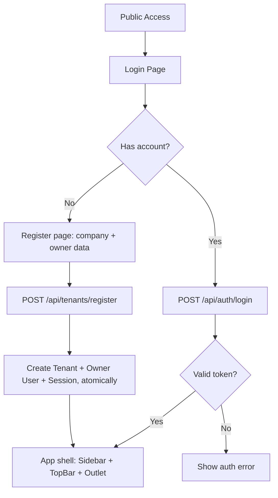
```mermaid
flowchart TD
  A[Public Access] --> B[Login Page]
  B --> C{Has account?}
  C -->|Yes| D[POST /api/auth/login]
  C -->|No| E[Register page: company + owner data]
  D --> F{Valid token?}
  F -->|Yes| G[App shell: Sidebar + TopBar + Outlet]
  F -->|No| H[Show auth error]

  E --> I[POST /api/tenants/register]
  I --> J[Create Tenant + Owner User + Session, atomically]
  J --> G
```

- Registration is a **single step**: company data + owner data together, `POST /api/tenants/register` creates Tenant + owner User + Session atomically — never a "tenant-less" user outside the invitation path.
- `POST /api/auth/register` (bare user, no tenant) exists only for the invitation-acceptance path.
- Every endpoint that returns a `user` object strips `passwordHash` first (`sanitizeUser` in `authService.ts`) — this used to leak to the client on every auth response until it was found and fixed.

## Invitation flow (email-backed, real send)

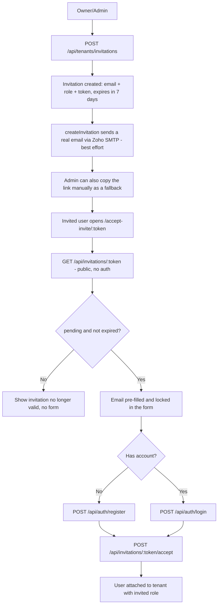
```mermaid
flowchart TD
  A[Owner/Admin] --> B[POST /api/tenants/invitations]
  B --> C[Invitation created: email + role + token, expires in 7 days]
  C --> D[createInvitation sends a real email via Zoho SMTP - best effort]
  D --> E[Admin can also copy the link manually as a fallback]
  E --> F[Invited user opens /accept-invite/:token]
  F --> G[GET /api/invitations/:token - public, no auth]
  G --> H{pending and not expired?}
  H -->|No| I[Show invitation no longer valid, no form]
  H -->|Yes| J[Email pre-filled and locked in the form]
  J --> K{Has account?}
  K -->|No| L[POST /api/auth/register]
  K -->|Yes| M[POST /api/auth/login]
  L --> N[POST /api/invitations/:token/accept]
  M --> N
  N --> O[User attached to tenant with invited role]
```

- Real email sending: `createInvitation` (`tenantService.ts`) calls `sendInvitationEmail` (`src/lib/mailer.ts`) after creating the invitation row. It's **best-effort** — a failed send doesn't fail the request, since the copyable link in the UI still works as a fallback.
- The accept page fetches the invitation's email/role/status *before* showing the form (`GET /api/invitations/:token`, public), so the email field comes pre-filled and disabled instead of being freely editable, and dead invitations show an error instead of a form nobody can submit successfully.
- This same `createInvitation` function backs **both** the generic tenant invite (Company Settings → Users → "Invite someone") and the per-employee invite (Employees table → "Invite" button) — one code path, one email template.

## Employee self-access flow

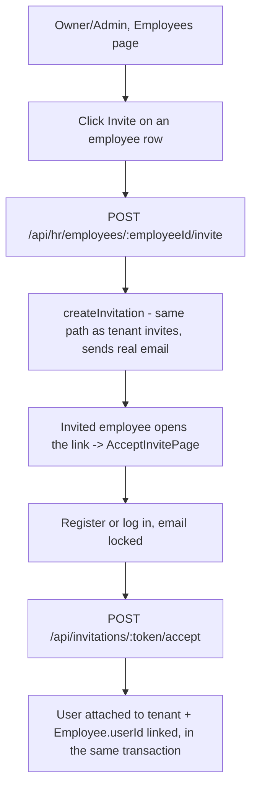
```mermaid
flowchart TD
  A[Owner/Admin, Employees page] --> B[Click Invite on an employee row]
  B --> C[POST /api/hr/employees/:employeeId/invite]
  C --> D[createInvitation - same path as tenant invites, sends real email]
  D --> E[Invited employee opens the link -> AcceptInvitePage]
  E --> F[Register or log in, email locked]
  F --> G[POST /api/invitations/:token/accept]
  G --> H[User attached to tenant + Employee.userId linked, in the same transaction]
```

- `Employee` optionally links to a `User` via `Employee.userId` (nullable, unique) — a link, not a merge of the two entities.
- The Employees table shows "Invite" for unlinked employees, "Linked" once `Employee.userId` is set.

## HR and Clients modules (parity)

Both modules follow the same pattern end to end:

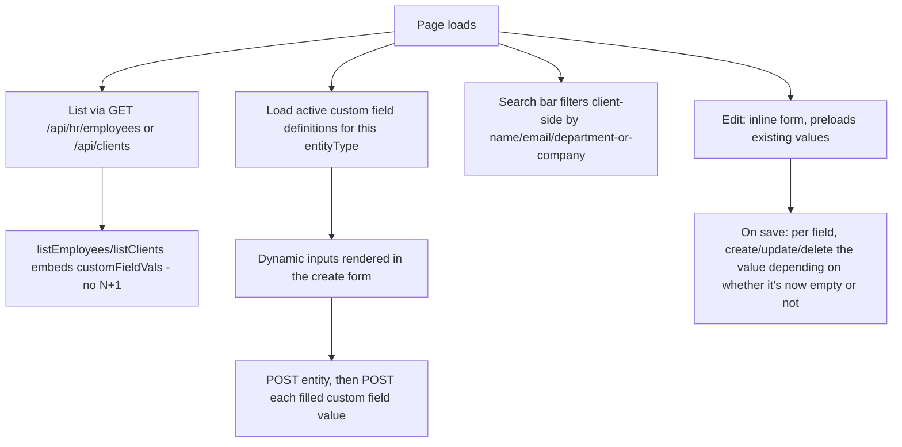
```mermaid
flowchart TD
  A[Page loads] --> B[List via GET /api/hr/employees or /api/clients]
  B --> C[listEmployees/listClients embeds customFieldVals - no N+1]
  A --> D[Load active custom field definitions for this entityType]
  D --> E[Dynamic inputs rendered in the create form]
  E --> F[POST entity, then POST each filled custom field value]
  A --> G[Search bar filters client-side by name/email/department-or-company]
  A --> H[Edit: inline form, preloads existing values]
  H --> I[On save: per field, create/update/delete the value depending on whether it's now empty or not]
```

- Custom fields are generic across modules: `CustomFieldValue` has `tenantId` + `entityType` (`employee`/`client`) + `entityId`, no per-module foreign key — adding a future module (e.g. Payments) never requires a schema change here.
- Every custom-field-value endpoint verifies the definition belongs to the right `entityType` before accepting a value (prevents using an Employee field to store a Client value via direct API calls).
- Statuses are no longer fixed enums — `Employee.statusId`/`Client.statusId`/`Company.statusId` are FKs to a per-tenant, per-module `StatusDefinition` catalog (name, color, order, isDefault, isActive), managed inline via the "Manage options" popover on each table's Status column header (see Settings section above — this moved out of a dedicated Settings page on 2026-07-16). Every tenant gets sensible defaults seeded on creation (Employee: Active/Inactive/Pending — Client: Prospect/Active/Inactive/Archived — Company: Prospect/Customer/Churned), but can add/rename/reorder/deactivate freely from there; don't assume any fixed set of status names in code. Every status change is recorded in `StatusHistoryEntry` (snapshotted status names, not live FKs, so a later rename doesn't rewrite old history) — captured today, no UI to view it yet.
- `Employee.department`/`jobTitleId` are **no longer free text** — both are FKs into `FieldCatalogDefinition` (a generic tenant-scoped catalog shared by Department/Job Title, and later reused by Contact's `leadSourceId`/Opportunity's `lossReasonId`), migrated 2026-07-22 via the project's safe-migration pattern (nullable FK added → backfill script groups existing free-text values per tenant, find-or-create a catalog entry, links every row → old text column dropped once nothing referenced it). `Status` was deliberately **not** folded into this same mechanism — it's a heavier feature (Kanban grouping, history, seeded defaults) and the migration risk outweighed the benefit.
- `Employee.managerId` is a self-referential FK ("reports to") — see the org hierarchy flow below. Every tenant's owner also gets an auto-created `Employee` record on signup so they always appear as a manager option, even before adding any real employees; a one-off `scripts/backfill-owner-employees.ts` did the same for pre-existing production tenants.

## Employee hierarchy (org chart)

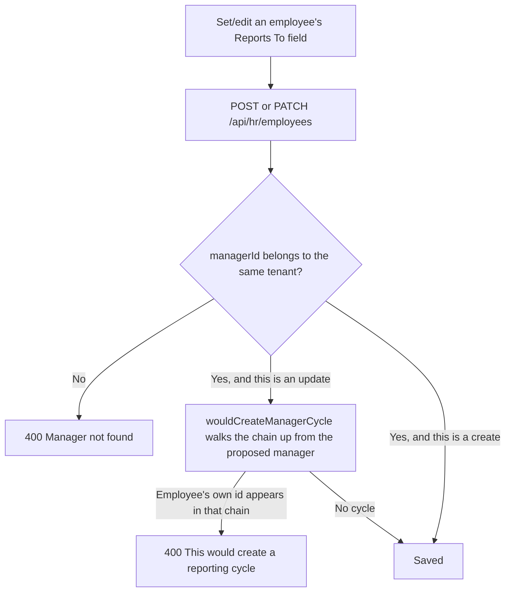
```mermaid
flowchart TD
  A[Set/edit an employee's Reports To field] --> B[POST or PATCH /api/hr/employees]
  B --> C{managerId belongs to the same tenant?}
  C -->|No| D[400 Manager not found]
  C -->|Yes, and this is an update| E[wouldCreateManagerCycle walks the chain up from the proposed manager]
  E -->|Employee's own id appears in that chain| F[400 This would create a reporting cycle]
  E -->|No cycle| G[Saved]
  C -->|Yes, and this is a create| G
```

- Covers both direct self-reporting (`employeeId === proposedManagerId`) and indirect cycles (A reports to B, B reports to A) via the same walk-up-the-chain check.
- This hierarchy is the routing backbone for PTO approvals (below) — a manager here is whoever an employee's requests get routed to by default.

## Settings navigation — one hub, module-specific settings live inline

This went through several iterations before settling. The two-independent-hubs model (Company Settings vs. sidebar Settings) described in earlier revisions of this document was itself replaced on 2026-07-16 — this section documents the **current**, single-hub shape:

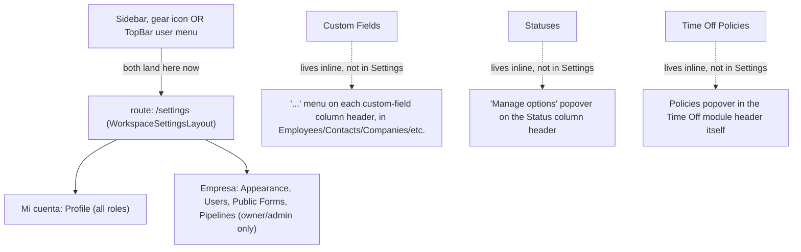
```mermaid
flowchart TD
  A[Sidebar, gear icon OR TopBar user menu] -->|both land here now| B["route: /settings (WorkspaceSettingsLayout)"]
  B --> C["Mi cuenta: Profile (all roles)"]
  B --> D["Empresa: Appearance, Users, Public Forms, Pipelines (owner/admin only)"]

  E[Custom Fields] -.->|lives inline, not in Settings| F["'...' menu on each custom-field column header, in Employees/Contacts/Companies/etc."]
  G[Statuses] -.->|lives inline, not in Settings| H["'Manage options' popover on the Status column header"]
  I[Time Off Policies] -.->|lives inline, not in Settings| J["Policies popover in the Time Off module header itself"]
```

- **One hub** (`WorkspaceSettingsLayout`, `/settings`) reached from both the sidebar gear icon and the TopBar user menu — the old split between "Company Settings" (`/company`) and module "Settings" was collapsed on 2026-07-16. `/profile` and `/company` still work as redirects to the new routes, so old bookmarks don't break.
- Two groups inside the hub: **"Mi cuenta"** (Profile — every role) and **"Empresa"** (Appearance, Users, Public Forms, Pipelines — owner/admin only, hidden for `member`).
- **What's explicitly NOT in this hub**: Custom Fields and Statuses were deliberately moved *out* of Settings and into contextual menus on the column headers of whichever table they belong to (a "..." menu per custom-field column, a single "Manage options" popover for Status) — the reasoning was that a setting used by exactly one module doesn't need its own separate page. Time Off Policies followed the same logic, moving into a popover in the Time Off module's own header instead of a Settings page.
- Each category inside `/settings` has its own internal sub-navigation (`.settings-shell`/`.settings-nav`/`.settings-content` in `App.css`) — a left-hand category list, content on the right — proven extensible in practice (grew from Profile+Appearance+Users to also include Public Forms and Pipelines with no structural rework).
- Statuses, Time Off Policies, and the Pipeline-stage manager all share the same `ColorPicker` component (`frontend/src/components/ColorPicker.tsx`) instead of a bare `<input type="color">` — preset swatches plus a popover for custom colors, saved to `localStorage` (key `northstack:customColors`) and shared across every picker in the app.
- `Profile` (edit own name/phone/password) is visible to every role; the "Empresa" group is gated to owner/admin inside the layout itself, not by hiding the sidebar entry (the gear icon is visible to everyone now, since Profile lives behind the same route).

## Company/Users management — ownership is unique by construction

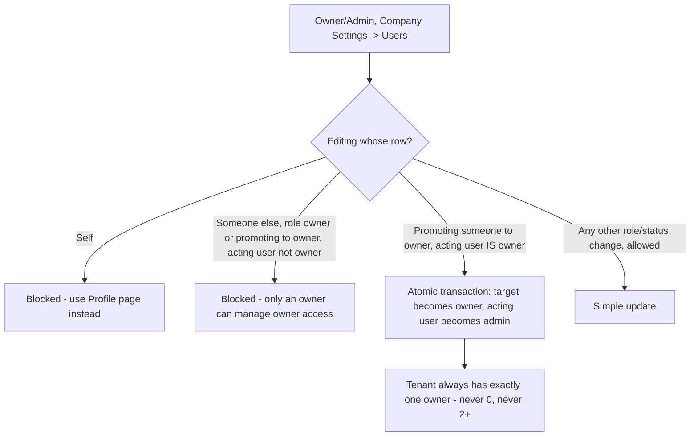
```mermaid
flowchart TD
  A[Owner/Admin, Company Settings -> Users] --> B{Editing whose row?}
  B -->|Self| C[Blocked - use Profile page instead]
  B -->|Someone else, role owner or promoting to owner, acting user not owner| D[Blocked - only an owner can manage owner access]
  B -->|Promoting someone to owner, acting user IS owner| E[Atomic transaction: target becomes owner, acting user becomes admin]
  B -->|Any other role/status change, allowed| F[Simple update]
  E --> G[Tenant always has exactly one owner - never 0, never 2+]
```

- Admin can freely edit roles/status for members and other admins — only touching the `owner` role (either target or destination) requires being an owner yourself.
- Promoting someone to owner is a **transfer**, not an addition: it happens in a single Prisma transaction that also demotes the acting owner to admin, so the tenant can never end up with zero or multiple owners — this replaced an earlier version where an owner could promote a second owner without losing their own role.

## Time Off system

Built piece by piece over 2026-07-14, at the user's explicit request ("arranca con eso nomás"), each piece confirmed and pushed separately. **Complete, 7 of 7 planned pieces** (the last one, a visual "on leave" tag on an employee's row, shipped the same day) — see `docs/database-schema.md` for the underlying tables (renamed `Pto*` → `TimeOff*` in the schema to match the name already used everywhere else) and `docs/tareas-desarrollo.md` for the full dated build log.

### Policy setup and per-employee assignment

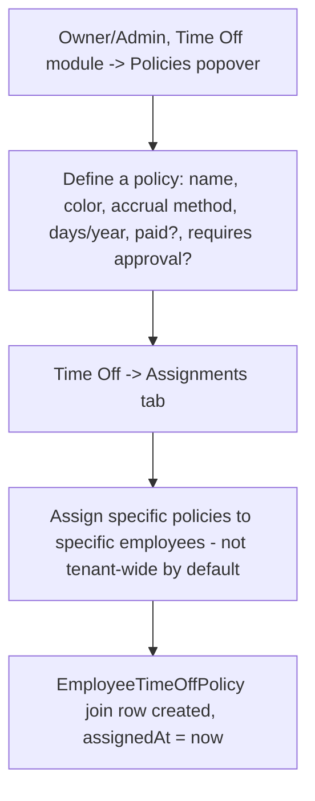
```mermaid
flowchart TD
  A[Owner/Admin, Time Off module -> Policies popover] --> B[Define a policy: name, color, accrual method, days/year, paid?, requires approval?]
  B --> C[Time Off -> Assignments tab]
  C --> D[Assign specific policies to specific employees - not tenant-wide by default]
  D --> E[EmployeeTimeOffPolicy join row created, assignedAt = now]
```

- `TimeOffPolicyDefinition.accrualMethod` supports two modes: `fixed_annual` (the full `daysPerYear` is available immediately) and `monthly` (accrues `daysPerYear / 12` per completed calendar month since `assignedAt`, capped at the annual total — the month a policy is assigned already counts, so nobody sees "0 days" on day one).
- A policy isn't automatically available to everyone — it has to be explicitly assigned per employee, which is what makes different day counts per seniority/contract type possible without needing multiple near-duplicate policies.

### Request + approval, routed by hierarchy

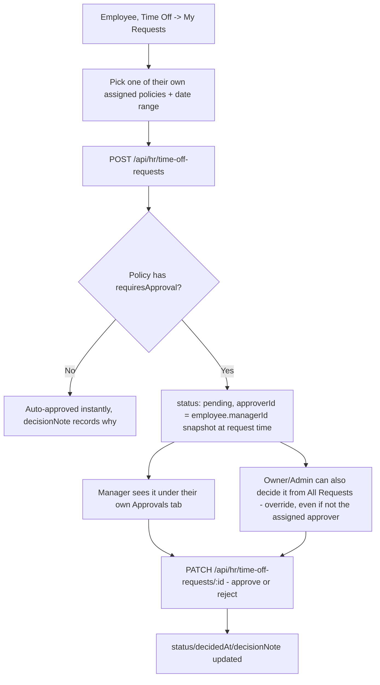
```mermaid
flowchart TD
  A[Employee, Time Off -> My Requests] --> B[Pick one of their own assigned policies + date range]
  B --> C[POST /api/hr/time-off-requests]
  C --> D{Policy has requiresApproval?}
  D -->|No| E[Auto-approved instantly, decisionNote records why]
  D -->|Yes| F["status: pending, approverId = employee.managerId snapshot at request time"]
  F --> G[Manager sees it under their own Approvals tab]
  G --> H[PATCH /api/hr/time-off-requests/:id - approve or reject]
  F --> I[Owner/Admin can also decide it from All Requests - override, even if not the assigned approver]
  I --> H
  H --> J[status/decidedAt/decisionNote updated]
```

- `approverId` is fixed at creation time from the employee's current `managerId` — it does not get recalculated if the org chart changes afterward.
- If an employee has no manager set, `approverId` stays `null` and the request only shows up for owner/admin to decide (no manager-specific "Approvals" tab entry for anyone).
- A requester can cancel their own request while it's still `pending` (`DELETE /api/hr/time-off-requests/:id`); once decided, cancellation isn't allowed — only future pieces (or manual DB access) can undo an approved/rejected request.

### Balance (derived, not stored)

- No new table — `timeOffBalanceService.ts` computes `allocated`/`used`/`pending`/`remaining` on every request by combining `EmployeeTimeOffPolicy.assignedAt`, the policy's accrual settings, and the sum of that employee+policy's `TimeOffRequest.daysRequested` for the current calendar year, split by status (`approved` counts as `used`, `pending` is shown separately and does **not** reduce `remaining` until it's actually approved).
- Exposed via `GET /api/hr/employees/:employeeId/time-off-balance` (self or owner/admin) and `GET /api/hr/time-off-balances` (tenant-wide, owner/admin only) — shown as chips above the request form in My Requests, and as a full table in the Balances tab.

### Calendar — and the new Overview home screen

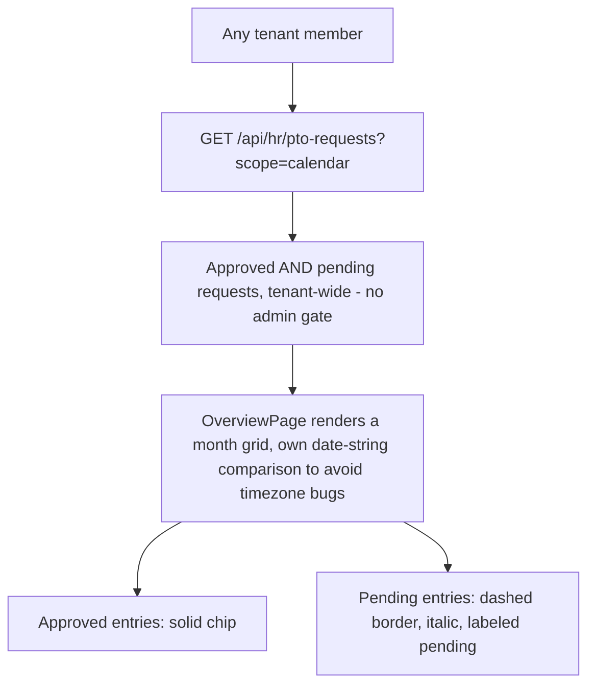
```mermaid
flowchart TD
  A[Any tenant member] --> B["GET /api/hr/pto-requests?scope=calendar"]
  B --> C[Approved AND pending requests, tenant-wide - no admin gate]
  C --> D[OverviewPage renders a month grid, own date-string comparison to avoid timezone bugs]
  D --> E[Approved entries: solid chip]
  D --> F[Pending entries: dashed border, italic, labeled pending]
```

- Unlike the other admin-facing Time Off views (`scope=all`, `/api/hr/time-off-balances`), the calendar scope has no role check — seeing who's out is treated as general team visibility, not an admin concern.
- The user asked for the calendar to live "dentro del overview como main page, por encima del label Human Resources" — this **replaced** the standing, undetailed backlog item "Overview / pantalla de inicio" that had been open for several rounds. `/overview` is now the default landing route after login, register, and accepting an invitation (previously `/hr/dashboard`), with its own sidebar entry (a `HomeIcon`, deliberately different from the `CalendarIcon` already used by the Time Off link, to avoid two identical icons in the sidebar).

## Saved Views, filters, and Kanban

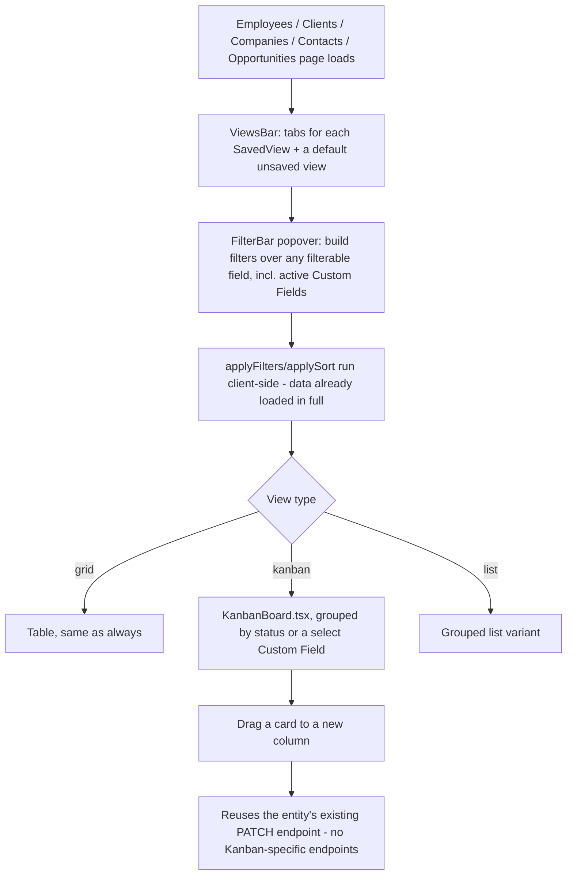
```mermaid
flowchart TD
  A[Employees / Clients / Companies / Contacts / Opportunities page loads] --> B[ViewsBar: tabs for each SavedView + a default unsaved view]
  B --> C[FilterBar popover: build filters over any filterable field, incl. active Custom Fields]
  C --> D[applyFilters/applySort run client-side - data already loaded in full]
  D --> E{View type}
  E -->|grid| F[Table, same as always]
  E -->|kanban| G[KanbanBoard.tsx, grouped by status or a select Custom Field]
  E -->|list| H[Grouped list variant]
  G --> I[Drag a card to a new column]
  I --> J[Reuses the entity's existing PATCH endpoint - no Kanban-specific endpoints]
```

- One model, `SavedView` (`entityType`/`type`/`visibility`/`filters`/`sortBy`/`groupByField` as JSON) — only owner/admin can create `shared` views; a `personal` view can only be deleted by whoever created it, not even the owner.
- The active view per entity persists in `localStorage` (`northstack:activeView:<entityType>`), same pattern as other per-device UI state in the app (theme, custom colors, column widths).
- Column width (drag-resize), visibility (show/hide), and order (drag-reorder) are **separate, per-view** `localStorage` keys (`northstack:columnWidths:<entityType>:<viewId>`, etc.) — this was a real bug fixed 2026-07-27: they used to be shared across all views of an entity, so hiding a column in one saved view silently hid it everywhere.

## Public Forms

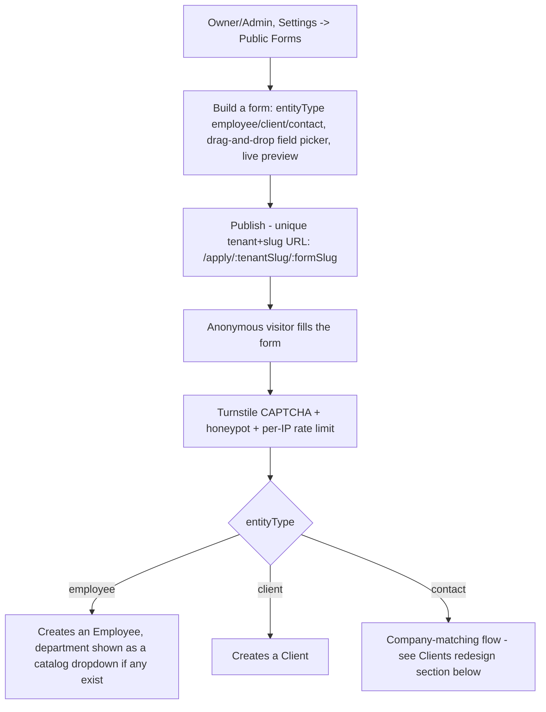
```mermaid
flowchart TD
  A[Owner/Admin, Settings -> Public Forms] --> B[Build a form: entityType employee/client/contact, drag-and-drop field picker, live preview]
  B --> C[Publish - unique tenant+slug URL: /apply/:tenantSlug/:formSlug]
  C --> D[Anonymous visitor fills the form]
  D --> E[Turnstile CAPTCHA + honeypot + per-IP rate limit]
  E --> F{entityType}
  F -->|employee| G[Creates an Employee, department shown as a catalog dropdown if any exist]
  F -->|client| H[Creates a Client]
  F -->|contact| I[Company-matching flow - see Clients redesign section below]
```

- `accessMode` (`public`/`internal`) exists on the model but only `public` has a working reach path today — `internal` forms fail closed (never served) on the anonymous route, since there's no authenticated submission flow built yet.
- The builder never shows firstName/lastName/email as configurable — always present, always required. Only optional fields (`department` for Employee, `company` for Client, `cf:<id>` for any active Custom Field of that entity type) go through the drag-and-drop picker. Contact forms have no such synthetic field at all, since Company matching happens automatically from the submitted email — see below.
- Submission notification emails go to every `owner`/`admin` of the tenant plus a confirmation to the submitter, best-effort (a failed send doesn't fail the submit).

## Clients redesign — Company, Contact, Pipeline, Opportunity (sales CRM)

Built 2026-07-27, 11 units, each committed and pushed to `staging` on its own — see `docs/database-schema.md` §5 for the full schema and `docs/tareas/semana-2026-07-21.md` for the unit-by-unit build log. Replaces the flat `Client` model (still fully live in parallel — see the note in `docs/database-schema.md` §2) with `Company` + `Contact`, plus a full sales pipeline (`Pipeline`/`PipelineStageDefinition`/`Opportunity`).

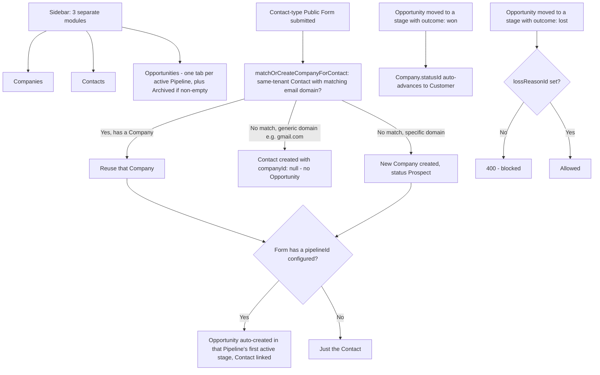
```mermaid
flowchart TD
  A[Sidebar: 3 separate modules] --> B[Companies]
  A --> C[Contacts]
  A --> D[Opportunities - one tab per active Pipeline, plus Archived if non-empty]

  E[Contact-type Public Form submitted] --> F[matchOrCreateCompanyForContact: same-tenant Contact with matching email domain?]
  F -->|Yes, has a Company| G[Reuse that Company]
  F -->|No match, generic domain e.g. gmail.com| H[Contact created with companyId: null - no Opportunity]
  F -->|No match, specific domain| I[New Company created, status Prospect]
  G --> J{Form has a pipelineId configured?}
  I --> J
  J -->|Yes| K[Opportunity auto-created in that Pipeline's first active stage, Contact linked]
  J -->|No| L[Just the Contact]

  M[Opportunity moved to a stage with outcome: won] --> N[Company.statusId auto-advances to Customer]
  O[Opportunity moved to a stage with outcome: lost] --> P{lossReasonId set?}
  P -->|No| Q[400 - blocked]
  P -->|Yes| R[Allowed]
```

- **`PipelineStageDefinition.outcome`** (`open`/`won`/`lost`) is the mechanism that lets the system detect Won/Lost without string-matching a tenant-renameable stage name — not in the original spec, added and confirmed with the user during planning.
- **Won → Customer is the only automated status trigger today.** Churned depends on a `Contract` entity (contract lapsing without renewal) that doesn't exist in this scope yet — `Churned` is a selectable Company status with no automatic driver, a known and accepted gap.
- **Archived Pipelines**: their Opportunities go read-only (blocked at both the UI selector level and the API level) but keep counting in historical reporting; the pipeline disappears from every creation selector.
- **Data migration** (`Client` → `Company`/`Contact`): `scripts/backfill-clients-to-companies-contacts.ts`, idempotent, dedupes `Client.company` free text into one `Company` per normalized name per tenant. Run and verified on `staging` (21 Companies/21 Contacts from 21 legacy Client rows); **not yet run against production** — waiting on the user reviewing staging first, same staging-first discipline as every code push. Surfaced and fixed a real bug along the way: tenants created before this schema shipped had zero `company`-entityType `StatusDefinition` rows, silently blocking Company creation entirely — the script seeds those retroactively for any tenant missing them.
- The old `Client` module (routes, page, sidebar entry) is untouched and fully functional — this migration is additive only. Hiding/removing it is a deliberately separate, not-yet-built follow-up, to be done only after the user has verified the migrated data.
- **Known gap, found 2026-07-28, not yet solved**: `OpportunityContact` linking is only reachable when *editing* an existing Opportunity — there's no way to attach a Contact at creation time, including the quick-add from a Kanban column's "+" card into a specific stage. Flagged by the user; deliberately not built yet, pending a product conversation on the right flow before implementing anything.
- **UX fix, 2026-07-28**: creating a Pipeline used to require saving it with just a name, then separately expanding it to add stages one at a time. "New Pipeline" now opens a `SlideOver` (same pattern as every other create-flow in the app) where the name and all stages (name + outcome) are entered together, created in one submit.

## Tasks & Notes (cross-entity) and the unified detail-panel redesign

Built 2026-07-29 to 2026-07-30 — see `docs/database-schema.md` §6 for the schema and `docs/tareas-desarrollo.md` (sección "Feedback de revisión UX post-Tasks") for the full checkpoint-by-checkpoint build log. Everything below is in `staging` only, nothing in production yet.

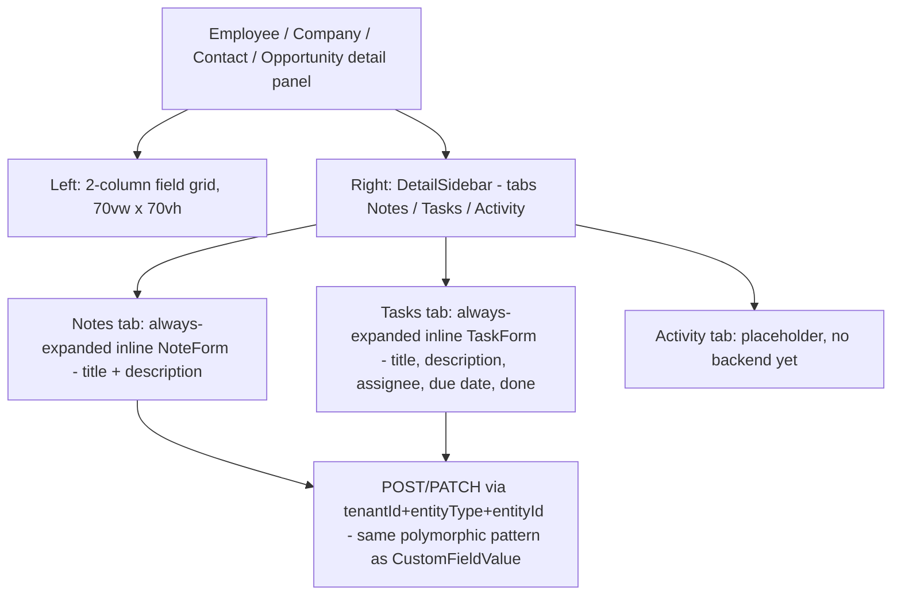
```mermaid
flowchart TD
  A[Employee / Company / Contact / Opportunity detail panel] --> B[Left: 2-column field grid, 70vw x 70vh]
  A --> C[Right: DetailSidebar - tabs Notes / Tasks / Activity]
  C --> D[Notes tab: always-expanded inline NoteForm - title + description]
  C --> E[Tasks tab: always-expanded inline TaskForm - title, description, assignee, due date, done]
  C --> F[Activity tab: placeholder, no backend yet]
  D --> G[POST/PATCH via tenantId+entityType+entityId - same polymorphic pattern as CustomFieldValue]
  E --> G
```

- **Task** and **Note** are both generic/cross-entity, same polymorphic `tenantId`+`entityType`+`entityId` pattern already used by `CustomFieldValue`/`StatusHistoryEntry` — `entityType` covers `employee`/`company`/`contact`/`opportunity` (not `client`). Shared lookup logic lives in `src/modules/crossModule/entityLookup.ts`.
- **Task** fields: title, description, assignee (tenant user), due date, done flag. Surfaces in 3 places: the Tasks tab of any entity's detail panel, the "My tasks" widget on `/overview`, and the `/overview` calendar.
- **Note** fields: title + description only (no assignee/date/done — it's a record, not a to-do). Renders `**bold**`/`*italic*` via a small custom regex-based renderer (`frontend/src/lib/lightMarkdown.tsx`, `renderNoteDescription`) instead of a markdown library. Field names were originally `header`/`body`, renamed to `title`/`description` to match Task (migrated via the project's standard nullable-first→backfill→drop pattern).
- **Permissions**: open to any role in the tenant for now (owner/admin/member) — confirmed as intentional, since this is a shared operational checklist/record, not sensitive data. Revisit once a custom-roles system exists (see Future roadmap notes).
- **Detail-panel redesign**: all 4 entity detail panels (`EmployeeOverviewPanel.tsx`, `CompanyDetailModal.tsx`, `ContactDetailModal.tsx`, `OpportunityDetailModal.tsx`) were unified onto the same shell — grew from a narrow ~460px centered popup to `70vw` × `70vh`, split into a 2-column field grid on the left (`Field` component gained a `full` prop / `overview-field-full` class for sections that need the whole width, like linked-record lists) and a shared `DetailSidebar.tsx` on the right. This was also the last of the 4 panels (`EmployeeOverviewPanel`) to drop its separate tabs+"Edit"-button form in favor of the same inline-autosave pattern the other 3 already had (Checkpoint F).
- **Compose UX**: Notes/Tasks compose forms used to be popovers that opened on click; now they're always-expanded inline forms in the sidebar (`TaskForm.tsx`/`NoteForm.tsx`) — simpler code (no anchor/positioning logic) and more discoverable. `TaskFormPopover.tsx` still exists as a thin wrapper for the 2 call sites that need a popover (`MyTasksWidget.tsx`, the `/overview` calendar) — both only ever open in edit mode, never "new". `NoteFormPopover.tsx` was deleted outright (no remaining consumer).
- **Row-freshness fix (autosave)**: every detail panel's `save()` now does two things after a successful `PATCH` — calls `onSaved(updated)` to instantly patch the specific row in the parent page's in-memory list using the PATCH response itself (no round-trip), and still calls `onChanged()` to trigger a silent background full-list refresh (no loading flash) for fields whose PATCH response doesn't include a relation label (e.g. changing `stageId` doesn't return the new `stage.name`). Before this fix, edits appeared to "not save" because the backend was updated correctly but the parent page's cached list was never told to refresh at all.
- **Delete-cascade rules, Contact/Company**: deleting a Contact or Company that has linked Opportunities used to crash on a raw FK constraint (`OpportunityContact` has no `onDelete: Cascade`). Both `deleteContact`/`deleteCompany` now take an optional `deleteLinkedOpportunities` flag to cascade-delete on purpose; deleting a Company always unlinks (never deletes) its Contacts.

## Frontend implementation status

- `frontend/src/App.tsx` holds top-level auth state (`token`, `user`) and the full route tree; `AppLayout` gates everything behind auth and renders `TopBar` + `Sidebar` + `Outlet`.
- Pages (current, `frontend/src/pages/`): `LoginPage`, `RegisterPage`, `AcceptInvitePage`, `OverviewPage` (home screen, Time Off calendar), `HrDashboardPage`/`ClientsDashboardPage` (placeholders), `EmployeesPage`, `ClientsPage`, `TimeOffOverviewPage` (Assignments/My Requests/Approvals/All Requests/Balances tabs), `ProfileSettingsPage`, `CompanyAppearancePage`, `CompanyUsersPage`, `PublicFormsSettingsPage`, `PipelinesSettingsPage`, `HelpPage`, `PublicFormPage` (the standalone `/apply` page) — plus, from the Clients redesign (see dedicated section below): `CompaniesPage`, `ContactsPage`, `OpportunitiesPage`. `CustomFieldsSettingsPage`/`StatusesSettingsPage`/`PtoPoliciesSettingsPage` no longer exist — deleted in the 2026-07-16 Settings rebrand when their functionality moved inline into each module's table header.
- Shared components worth knowing about: `ColorPicker.tsx` (preset + custom color popover, used by Statuses/Time Off Policies/Pipeline stages), `Icons.tsx` (hand-drawn inline SVGs, no icon library dependency — includes `HomeIcon`/`CalendarIcon`/`TrendingIcon` added specifically to keep every sidebar entry visually distinct), `KanbanBoard.tsx` (generic drag-and-drop board — powers both SavedView Kanban and the Opportunity pipeline board), `SlideOver.tsx`/`Popover.tsx`/`ConfirmDialog.tsx`/`ToastProvider.tsx` (shared UI chrome used everywhere), `DetailSidebar.tsx`/`TaskForm.tsx`/`NoteForm.tsx`/`Field.tsx` (shared across all 4 entity detail panels since the 2026-07-30 redesign, see dedicated section above), `SearchableSelect.tsx` (generic Popover-based searchable dropdown, added for Contact→Company assignment).
- Dark mode: Tailwind v4 class-based `dark:` variant (`@custom-variant dark`), toggle lives in `/settings` → Appearance, preference stored in `localStorage` per device (not synced tenant-wide — a deliberate scope call, flagged as not confirmed with the user beyond "it works").
- Verified end-to-end via `curl` against the real backend for every flow above; the user has been clicking through the actual deployed app in the browser throughout, catching several real UX/security gaps (illegible role dropdown in dark mode, editable email on the invite-accept page, missing copy-link on the Company invite form) that got fixed the same session.

## Future roadmap notes (not started)

- **Clients redesign — remaining pieces**: (1) run the Client→Company/Contact backfill against production, blocked on the user reviewing staging; (2) the actual cutover (hide/remove the `Client` module) once the user has verified the migrated data — deliberately not started; (3) lead qualification without enough Form volume yet, and Opportunity automations (stage-change emails, auto-assign owner, stale-deal reminders) — both explicitly postponed by the user until there's real usage evidence to design against.
- **Payments/subscriptions billing** — open topic, not decided. International reach is the stated goal; Stripe directly would require a US entity (Argentina isn't a Stripe direct-payout country), so Paddle (merchant-of-record, handles international tax, no US entity needed, higher fee) is the current leading option. Needs: plan/pricing definition, trial policy, and what happens to a tenant on payment failure/cancellation.
- **Payroll module (V1)** — confirmed and scoped in the backlog (`docs/tareas-desarrollo.md`, Tier 3.5) but not started: manual pay-run data entry + derived cost metrics, distinct from Payments (which is billing the tenant's own Clients/Companies, not paying Employees).
- **Roles**: currently fixed (`owner`/`admin`/`member`) with hardcoded permissions in `permissionService.ts`. A custom-roles system is a noted idea, not scoped — Task/Note permissions (currently open to any role) are meant to be revisited once this exists.
- **Audit logging**: per-user login + modification history. Noted idea, not scoped — the Activity tab in the new detail-panel sidebar is UI-ready (see Tasks & Notes section above) but has no backend behind it yet; this is what would fill it in.
- **Platform admin panel** for the Northstack owner (not a tenant owner) to see all tenants — needs a wholly separate, cross-tenant role system, since `owner`/`admin`/`member` are all per-tenant today. Not started.
- **Mobile/tablet responsiveness** — nothing in `frontend/` adapts to small screens today (fixed sidebar, no table scroll, no hamburger menu). Not started.
- **Public API with token auth** for external integrations — not started.
- Full backlog with dated notes lives in `docs/tareas-desarrollo.md` — that file is the source of truth for granular status; this file is the architectural/flow summary.
