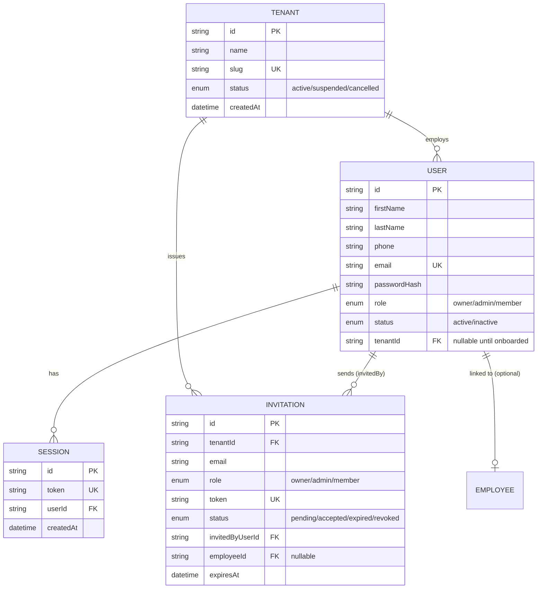
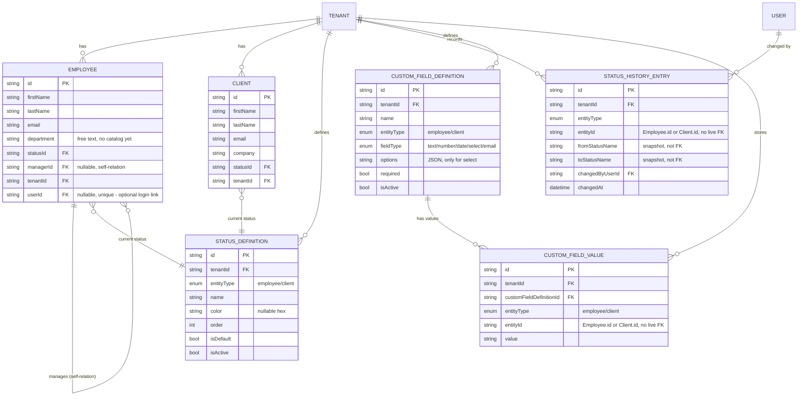
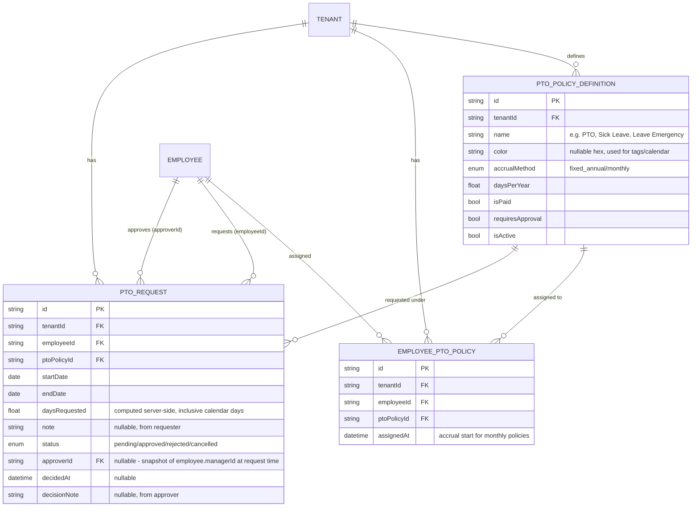

# Database Schema

- Última actualización: 2026-07-14
- Fuente de verdad real: `prisma/schema.prisma`. Este documento es una vista legible de ese archivo — si difieren, el `.prisma` manda. Regenerar este archivo cuando el schema cambie de forma significativa (modelo nuevo, relación nueva), no hace falta para cambios chicos (un campo opcional más, un índice).
- Todos los modelos son multi-tenant: casi todos tienen `tenantId` directo (no derivado por join), y el aislamiento entre tenants se verifica en el código de cada endpoint (ownership check), no solo por FK — ver `docs/current-process-flow.md` para el patrón de verificación.

## Cómo leer los diagramas

Se dividen en 3 grupos por área funcional, no uno solo gigante, para que sean legibles:

1. **Identidad y acceso** — Tenant, User, Session, Invitation.
2. **HR core** — Employee, Client, catálogos configurables (Status, Custom Fields).
3. **PTO/vacaciones** — políticas, asignación por empleado, solicitudes.

## 1. Identidad y acceso

Notas:
- `User.tenantId` es nullable — un `User` sin tenant existe momentáneamente solo en el flujo de aceptar invitación (`POST /api/auth/register` crea el usuario "suelto", y `POST /api/invitations/:token/accept` lo adjunta al tenant en la misma operación).
- `Invitation` no fuerza un solo uso por email — el guardrail real (no invitar a alguien que ya pertenece a un tenant) vive en `createInvitation`, no en el schema.
- `Session` no tiene expiración — el logout es explícito (`DELETE`/`POST /api/auth/logout` borra la fila). No hay TTL automático todavía.

## 2. HR core

Notas — 2 patrones deliberados que se repiten en todo el schema:
- **`entityType` genérico en vez de una FK por módulo**: tanto `CustomFieldValue` como `StatusDefinition`/`StatusHistoryEntry` usan `tenantId` + `entityType` (`employee`/`client`) + `entityId` (sin FK real de Prisma — se verifica en código) en vez de columnas `employeeId`/`clientId` separadas. Un módulo nuevo (ej. Payments) nunca requiere una migración de schema para heredar custom fields o catálogo de status — solo agregar el valor de enum correspondiente.
- **Historial por snapshot, no por FK viva**: `StatusHistoryEntry.fromStatusName`/`toStatusName` guardan el *nombre* del status al momento del cambio, no una referencia a `StatusDefinition`. Si alguien renombra un status después, el historial viejo no se reescribe retroactivamente.
- `Employee.managerId` es una relación auto-referencial (`Employee` apunta a otro `Employee` como su manager) — ver `wouldCreateManagerCycle` en `employeeService.ts` para la validación anti-ciclo que la acompaña.
- Todo tenant nuevo siembra automáticamente un `Employee` para su owner (`department: "Leadership"`) y un catálogo de `StatusDefinition` por defecto (Employee: Active/Inactive/Pending — Client: Prospect/Active/Inactive/Archived) — ver `tenantService.ts`.

## 3. PTO / vacaciones

Notas:
- `EmployeePtoPolicy` es la tabla de unión muchos-a-muchos entre `Employee` y `PtoPolicyDefinition` — un empleado puede tener varias políticas activas (ej. "PTO" + "Sick Leave"), y una política puede estar asignada a varios empleados. `@@unique([employeeId, ptoPolicyId])` evita duplicados.
- `PtoRequest.approverId` se fija **al momento de crear la solicitud**, copiando el `managerId` del empleado en ese instante — es un snapshot, no se recalcula si el manager cambia después. Si el empleado no tiene manager asignado, `approverId` queda `null` y cualquier owner/admin puede decidir la solicitud como fallback.
- El balance de días (asignado/usado/pendiente/restante) **no se guarda en ninguna tabla** — se calcula al vuelo combinando `EmployeePtoPolicy.assignedAt`, los campos de acumulación de `PtoPolicyDefinition`, y la suma de `PtoRequest.daysRequested` por status, todo dentro del año calendario actual (`ptoBalanceService.ts`).
- Si `PtoPolicyDefinition.requiresApproval` es `false`, la solicitud nace directo en `status: approved` (sin pasar por nadie) — `decisionNote` queda con un texto fijo indicando que fue auto-aprobada.
- El tag visual "de licencia" que se ve en la fila del empleado (Employees) es el mismo patrón que el balance: **no es una columna**, se deriva en cada `GET /api/hr/employees` buscando si el empleado tiene una `PtoRequest` con `status: approved` cuyo rango de fechas cubre el día de hoy.

## Enums

| Enum | Valores | Usado en |
|---|---|---|
| `UserRole` | `owner`, `admin`, `member` | `User.role`, `Invitation.role` |
| `UserStatus` | `active`, `inactive` | `User.status` |
| `TenantStatus` | `active`, `suspended`, `cancelled` | `Tenant.status` |
| `FieldType` | `text`, `number`, `date`, `select`, `email` | `CustomFieldDefinition.fieldType` |
| `EntityType` | `employee`, `client` | `StatusDefinition`/`StatusHistoryEntry`/`CustomFieldDefinition`/`CustomFieldValue`.entityType |
| `InvitationStatus` | `pending`, `accepted`, `expired`, `revoked` | `Invitation.status` |
| `PtoAccrualMethod` | `fixed_annual`, `monthly` | `PtoPolicyDefinition.accrualMethod` |
| `PtoRequestStatus` | `pending`, `approved`, `rejected`, `cancelled` | `PtoRequest.status` |

## Qué falta / deuda conocida

- `Employee.department` sigue siendo texto libre, sin catálogo — a diferencia de `status`, que ya tiene `StatusDefinition`. Backlog: `DepartmentDefinition` con el mismo patrón (ver `docs/tareas-desarrollo.md`).
- No hay historial de valores previos de `CustomFieldValue` (pospuesto a propósito).
- `Session` no expira sola — no hay TTL ni limpieza automática de sesiones viejas.
- El sistema de PTO está completo (7/7 piezas, incluyendo el tag visual en la fila del empleado — derivado en cada request desde `PtoRequest`, sin campo nuevo en `Employee`).
