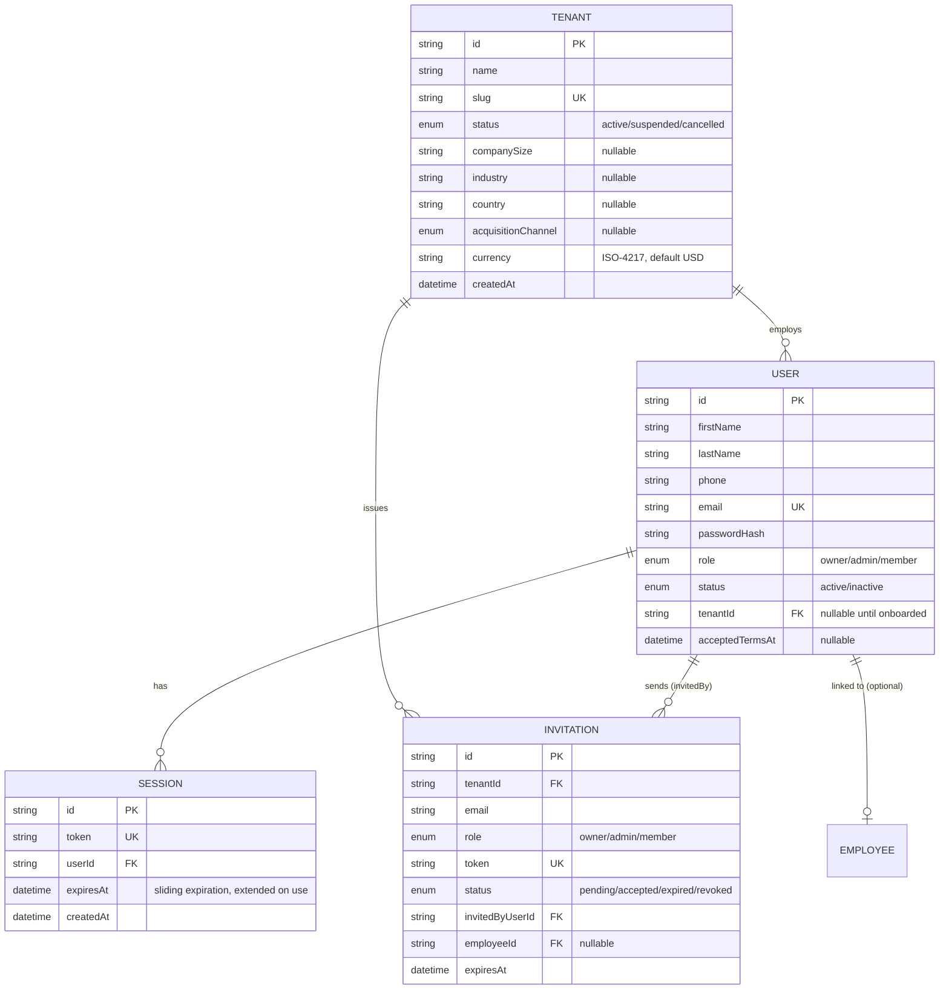
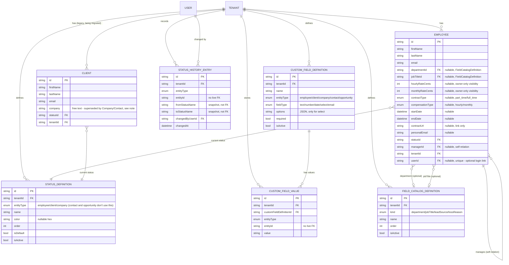
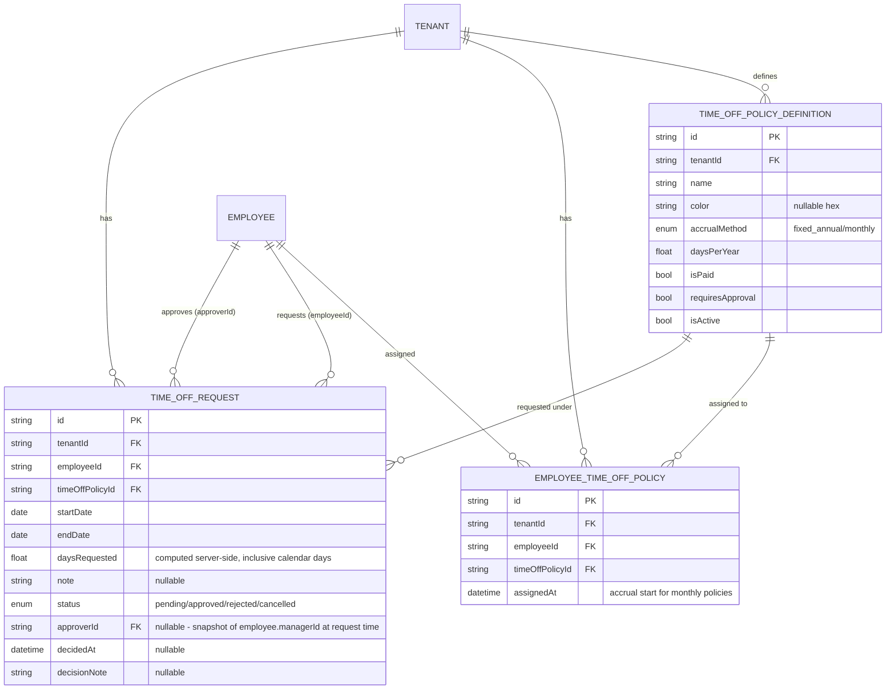
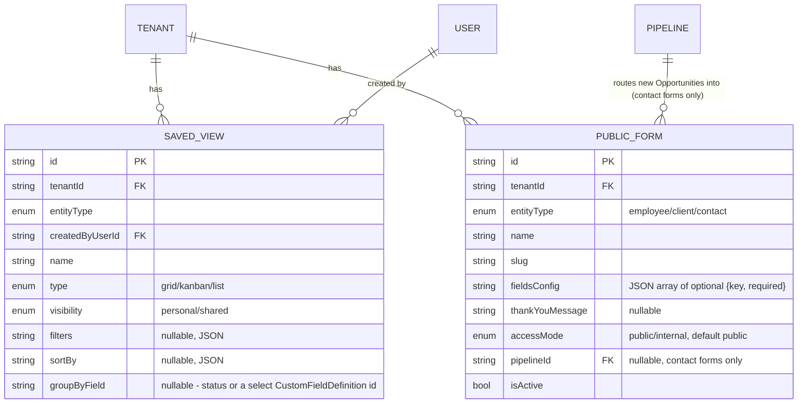
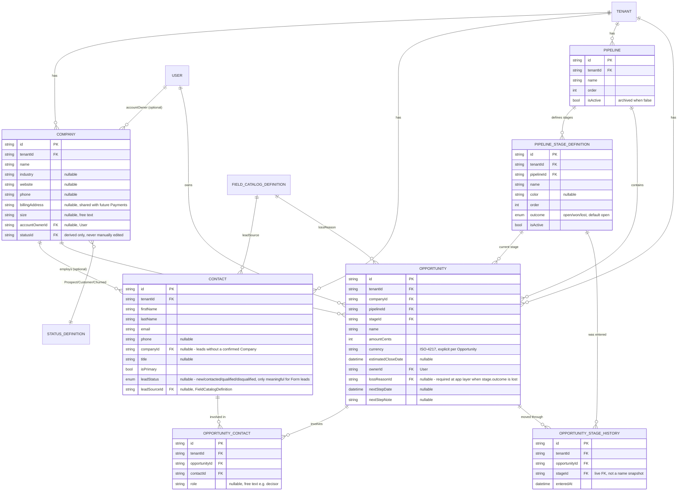

# Database Schema

- Última actualización: 2026-07-27
- Fuente de verdad real: `prisma/schema.prisma`. Este documento es una vista legible de ese archivo — si difieren, el `.prisma` manda. Regenerar este archivo cuando el schema cambie de forma significativa (modelo nuevo, relación nueva), no hace falta para cambios chicos (un campo opcional más, un índice).
- Todos los modelos son multi-tenant: casi todos tienen `tenantId` directo (no derivado por join), y el aislamiento entre tenants se verifica en el código de cada endpoint (ownership check), no solo por FK — ver `docs/current-process-flow.md` para el patrón de verificación.

## Cómo leer los diagramas

Se dividen en grupos por área funcional, no uno solo gigante, para que sean legibles:

1. **Identidad y acceso** — Tenant, User, Session, Invitation.
2. **HR core** — Employee, Client (legado, ver nota abajo), catálogos configurables (Status, Custom Fields, Field Catalog).
3. **Time Off** — políticas, asignación por empleado, solicitudes.
4. **Vistas y formularios** — SavedView, PublicForm.
5. **Sales / Clients redesign** — Company, Contact, Pipeline, Opportunity y su historial.

## 1. Identidad y acceso

```mermaid
erDiagram
    TENANT ||--o{ USER : "employs"
    TENANT ||--o{ INVITATION : "issues"
    USER ||--o{ SESSION : "has"
    USER ||--o{ INVITATION : "sends (invitedBy)"
    USER ||--o| EMPLOYEE : "linked to (optional)"

    TENANT {
        string id PK
        string name
        string slug UK
        enum status "active/suspended/cancelled"
        string companySize "nullable"
        string industry "nullable"
        string country "nullable"
        enum acquisitionChannel "nullable"
        string currency "ISO-4217, default USD"
        datetime createdAt
    }
    USER {
        string id PK
        string firstName
        string lastName
        string phone
        string email UK
        string passwordHash
        enum role "owner/admin/member"
        enum status "active/inactive"
        string tenantId FK "nullable until onboarded"
        datetime acceptedTermsAt "nullable"
    }
    SESSION {
        string id PK
        string token UK
        string userId FK
        datetime expiresAt "sliding expiration, extended on use"
        datetime createdAt
    }
    INVITATION {
        string id PK
        string tenantId FK
        string email
        enum role "owner/admin/member"
        string token UK
        enum status "pending/accepted/expired/revoked"
        string invitedByUserId FK
        string employeeId FK "nullable"
        datetime expiresAt
    }
```

Notas:
- `User.tenantId` es nullable — un `User` sin tenant existe momentáneamente solo en el flujo de aceptar invitación (`POST /api/auth/register` crea el usuario "suelto", y `POST /api/invitations/:token/accept` lo adjunta al tenant en la misma operación).
- `Invitation` no fuerza un solo uso por email — el guardrail real (no invitar a alguien que ya pertenece a un tenant) vive en `createInvitation`, no en el schema.
- `Session.expiresAt` es **expiración deslizante**: cada uso válido la extiende (solo si falta menos de 1 día, para no pagar el costo de un `UPDATE` en cada request autenticado). Cambiar la propia contraseña revoca todas las demás sesiones del usuario. Se agregó vía migración segura (nullable → backfill de las sesiones existentes → `NOT NULL`), documentada en `docs/tareas/semana-2026-07-21.md`.
- `Tenant.companySize`/`industry`/`country`/`acquisitionChannel` y `User.acceptedTermsAt` son campos del formulario de Sign Up ampliado (2026-07-22) — todos nullable, no retroactivos.

## 2. HR core

```mermaid
erDiagram
    TENANT ||--o{ EMPLOYEE : "has"
    TENANT ||--o{ CLIENT : "has (legacy, being migrated)"
    TENANT ||--o{ STATUS_DEFINITION : "defines"
    TENANT ||--o{ STATUS_HISTORY_ENTRY : "records"
    TENANT ||--o{ CUSTOM_FIELD_DEFINITION : "defines"
    TENANT ||--o{ CUSTOM_FIELD_VALUE : "stores"
    TENANT ||--o{ FIELD_CATALOG_DEFINITION : "defines"

    EMPLOYEE ||--o{ EMPLOYEE : "manages (self-relation)"
    EMPLOYEE }o--|| STATUS_DEFINITION : "current status"
    EMPLOYEE }o--o| FIELD_CATALOG_DEFINITION : "department (optional)"
    EMPLOYEE }o--o| FIELD_CATALOG_DEFINITION : "jobTitle (optional)"
    CLIENT }o--|| STATUS_DEFINITION : "current status"
    USER ||--o{ STATUS_HISTORY_ENTRY : "changed by"
    CUSTOM_FIELD_DEFINITION ||--o{ CUSTOM_FIELD_VALUE : "has values"

    EMPLOYEE {
        string id PK
        string firstName
        string lastName
        string email
        string departmentId FK "nullable, FieldCatalogDefinition"
        string jobTitleId FK "nullable, FieldCatalogDefinition"
        int hourlyRateCents "nullable, owner-only visibility"
        int monthlyRateCents "nullable, owner-only visibility"
        enum contractType "nullable, part_time/full_time"
        enum compensationType "nullable, hourly/monthly"
        datetime startDate "nullable"
        datetime endDate "nullable"
        string contractUrl "nullable, link only"
        string personalEmail "nullable"
        string statusId FK
        string managerId FK "nullable, self-relation"
        string tenantId FK
        string userId FK "nullable, unique - optional login link"
    }
    CLIENT {
        string id PK
        string firstName
        string lastName
        string email
        string company "free text - superseded by Company/Contact, see note"
        string statusId FK
        string tenantId FK
    }
    STATUS_DEFINITION {
        string id PK
        string tenantId FK
        enum entityType "employee/client/company (contact and opportunity don't use this)"
        string name
        string color "nullable hex"
        int order
        bool isDefault
        bool isActive
    }
    STATUS_HISTORY_ENTRY {
        string id PK
        string tenantId FK
        enum entityType
        string entityId "no live FK"
        string fromStatusName "snapshot, not FK"
        string toStatusName "snapshot, not FK"
        string changedByUserId FK
        datetime changedAt
    }
    CUSTOM_FIELD_DEFINITION {
        string id PK
        string tenantId FK
        string name
        enum entityType "employee/client/company/contact/opportunity"
        enum fieldType "text/number/date/select/email"
        string options "JSON, only for select"
        bool required
        bool isActive
    }
    CUSTOM_FIELD_VALUE {
        string id PK
        string tenantId FK
        string customFieldDefinitionId FK
        enum entityType
        string entityId "no live FK"
        string value
    }
    FIELD_CATALOG_DEFINITION {
        string id PK
        string tenantId FK
        enum kind "department/jobTitle/leadSource/lossReason"
        string name
        int order
        bool isActive
    }
```

Notas — patrones deliberados que se repiten en todo el schema:
- **`entityType` genérico en vez de una FK por módulo**: tanto `CustomFieldValue` como `StatusDefinition`/`StatusHistoryEntry` usan `tenantId` + `entityType` + `entityId` (sin FK real de Prisma — se verifica en código) en vez de columnas `employeeId`/`clientId`/`companyId` separadas. Un módulo nuevo nunca requiere una migración de schema para heredar custom fields o catálogo de status — solo agregar el valor de enum correspondiente. `entityType` (`EntityType` enum) hoy tiene 5 valores: `employee`, `client`, `company`, `contact`, `opportunity` — los últimos 3 se agregaron para el rediseño de Clients (ver grupo 5).
- **Historial por snapshot, no por FK viva**: `StatusHistoryEntry.fromStatusName`/`toStatusName` guardan el *nombre* del status al momento del cambio, no una referencia a `StatusDefinition`. Si alguien renombra un status después, el historial viejo no se reescribe retroactivamente. Contraste deliberado: `OpportunityStageHistory` (grupo 5) sí usa una FK viva — ver esa sección.
- **`FieldCatalogDefinition` — catálogo genérico compartido**, distinto de `StatusDefinition` a propósito: nace para `Employee.department`/`jobTitleId` (ambos eran texto libre, migrados a FK vía el patrón de migración segura — push aditivo → backfill → endurecer a requerido/borrar columna vieja), y se reutilizó para `Contact.leadSourceId` y `Opportunity.lossReasonId` (`kind: 'leadSource'`/`'lossReason'`) en vez de crear 2 tablas nuevas. `Status` deliberadamente **no** se unificó en este mecanismo — es una feature más pesada (agrupamiento de Kanban, historial, guardrail de `isDefault`, sembrado automático por tenant) y migrarla hubiera sido riesgo real de regresión por poco beneficio.
- `Employee.managerId` es una relación auto-referencial — ver `wouldCreateManagerCycle` en `employeeService.ts` para la validación anti-ciclo que la acompaña.
- **`Client` — modelo legado, en proceso de reemplazo**: ver grupo 5 (Sales / Clients redesign) para el reemplazo (`Company` + `Contact`). `Client` sigue totalmente funcional (rutas, UI, custom fields) en paralelo mientras dura la migración — no se tocó ni se va a tocar hasta un corte deliberado y aprobado por separado. Todo tenant nuevo sigue sembrando su catálogo de `StatusDefinition` por defecto (Employee: Active/Inactive/Pending — Client: Prospect/Active/Inactive/Archived — Company: Prospect/Customer/Churned).

## 3. Time Off

Renombrado de "PTO" a "Time Off" en el schema (`PtoPolicyDefinition`→`TimeOffPolicyDefinition`, etc.) — el nombre visible en la UI y en la documentación de producto ya era "Time Off" desde el principio, el schema tenía el nombre viejo.

```mermaid
erDiagram
    TENANT ||--o{ TIME_OFF_POLICY_DEFINITION : "defines"
    TENANT ||--o{ EMPLOYEE_TIME_OFF_POLICY : "has"
    TENANT ||--o{ TIME_OFF_REQUEST : "has"

    EMPLOYEE ||--o{ EMPLOYEE_TIME_OFF_POLICY : "assigned"
    TIME_OFF_POLICY_DEFINITION ||--o{ EMPLOYEE_TIME_OFF_POLICY : "assigned to"
    EMPLOYEE ||--o{ TIME_OFF_REQUEST : "requests (employeeId)"
    EMPLOYEE ||--o{ TIME_OFF_REQUEST : "approves (approverId)"
    TIME_OFF_POLICY_DEFINITION ||--o{ TIME_OFF_REQUEST : "requested under"

    TIME_OFF_POLICY_DEFINITION {
        string id PK
        string tenantId FK
        string name
        string color "nullable hex"
        enum accrualMethod "fixed_annual/monthly"
        float daysPerYear
        bool isPaid
        bool requiresApproval
        bool isActive
    }
    EMPLOYEE_TIME_OFF_POLICY {
        string id PK
        string tenantId FK
        string employeeId FK
        string timeOffPolicyId FK
        datetime assignedAt "accrual start for monthly policies"
    }
    TIME_OFF_REQUEST {
        string id PK
        string tenantId FK
        string employeeId FK
        string timeOffPolicyId FK
        date startDate
        date endDate
        float daysRequested "computed server-side, inclusive calendar days"
        string note "nullable"
        enum status "pending/approved/rejected/cancelled"
        string approverId FK "nullable - snapshot of employee.managerId at request time"
        datetime decidedAt "nullable"
        string decisionNote "nullable"
    }
```

Notas:
- `EmployeeTimeOffPolicy` es la tabla de unión muchos-a-muchos — `@@unique([employeeId, timeOffPolicyId])` evita duplicados.
- `TimeOffRequest.approverId` se fija **al momento de crear la solicitud**, copiando el `managerId` del empleado en ese instante — snapshot, no se recalcula si el manager cambia después. Sin manager asignado, cualquier owner/admin puede decidir como fallback.
- El balance de días (asignado/usado/pendiente/restante) **no se guarda en ninguna tabla** — se calcula al vuelo (`timeOffBalanceService.ts`).
- Si `requiresApproval` es `false`, la solicitud nace directo en `status: approved`.
- El tag visual de "de licencia" en la fila del empleado se deriva en cada `GET /api/hr/employees`, no es una columna.
- Sistema completo (7/7 piezas: jerarquía, políticas, asignación, solicitud/aprobación, balance, calendario, tag visual) desde 2026-07-14.

## 4. Vistas y formularios

```mermaid
erDiagram
    TENANT ||--o{ SAVED_VIEW : "has"
    TENANT ||--o{ PUBLIC_FORM : "has"
    USER ||--o{ SAVED_VIEW : "created by"
    PIPELINE ||--o{ PUBLIC_FORM : "routes new Opportunities into (contact forms only)"

    SAVED_VIEW {
        string id PK
        string tenantId FK
        enum entityType
        string createdByUserId FK
        string name
        enum type "grid/kanban/list"
        enum visibility "personal/shared"
        string filters "nullable, JSON"
        string sortBy "nullable, JSON"
        string groupByField "nullable - status or a select CustomFieldDefinition id"
    }
    PUBLIC_FORM {
        string id PK
        string tenantId FK
        enum entityType "employee/client/contact"
        string name
        string slug
        string fieldsConfig "JSON array of optional {key, required}"
        string thankYouMessage "nullable"
        enum accessMode "public/internal, default public"
        string pipelineId FK "nullable, contact forms only"
        bool isActive
    }
```

Notas:
- `SavedView`: solo owner/admin crean vistas `shared`; borrar una vista `personal` es exclusivo de quien la creó. Mover una card en Kanban reutiliza los `PATCH` ya existentes de cada entidad (por `statusId` o custom field), sin endpoints nuevos.
- `PublicForm`: conceptualmente "Form" en el rediseño de Clients (ya no exclusivamente público desde que existe `accessMode`), pero **se mantuvo el nombre de tabla** `PublicForm` — un rename real por `db push` es riesgoso sin herramienta de migraciones formal, sin beneficio funcional. `accessMode: 'internal'` está en el schema pero sin flujo de acceso autenticado construido todavía — `findActivePublicForm` falla cerrado (nunca sirve un form `internal` en la ruta pública anónima).
- `PublicForm.pipelineId` (nuevo, rediseño de Clients): solo aplica a `entityType: 'contact'`. Si está seteado, un submit que matchea o crea una Company también crea una Opportunity en el primer stage activo de ese Pipeline — ver grupo 5.
- `fieldsConfig` nunca incluye firstName/lastName/email (siempre presentes y requeridos) — solo campos opcionales (`department`/`company` para Employee/Client, o `cf:<id>` para custom fields; los forms de Contact no tienen un campo "hardcodeado" equivalente, porque el matching de Company es automático por dominio de email, no cargado a mano).

## 5. Sales / Clients redesign (Company, Contact, Pipeline, Opportunity)

Reemplaza gradualmente al `Client` legado del grupo 2 (ver ahí la nota de convivencia). Spec completo en `docs/tareas-desarrollo.md` líneas ~389-411; construido pieza por pieza (11 unidades) 2026-07-27, cada una commiteada y pusheada a `staging` por separado.

```mermaid
erDiagram
    TENANT ||--o{ COMPANY : "has"
    TENANT ||--o{ CONTACT : "has"
    TENANT ||--o{ PIPELINE : "has"
    TENANT ||--o{ OPPORTUNITY : "has"

    COMPANY ||--o{ CONTACT : "employs (optional)"
    COMPANY ||--o{ OPPORTUNITY : "has deals"
    COMPANY }o--|| STATUS_DEFINITION : "Prospect/Customer/Churned"
    USER ||--o{ COMPANY : "accountOwner (optional)"

    PIPELINE ||--o{ PIPELINE_STAGE_DEFINITION : "defines stages"
    PIPELINE ||--o{ OPPORTUNITY : "contains"
    PIPELINE_STAGE_DEFINITION ||--o{ OPPORTUNITY : "current stage"
    PIPELINE_STAGE_DEFINITION ||--o{ OPPORTUNITY_STAGE_HISTORY : "was entered"

    OPPORTUNITY ||--o{ OPPORTUNITY_CONTACT : "involves"
    CONTACT ||--o{ OPPORTUNITY_CONTACT : "involved in"
    OPPORTUNITY ||--o{ OPPORTUNITY_STAGE_HISTORY : "moved through"
    USER ||--o{ OPPORTUNITY : "owns"
    FIELD_CATALOG_DEFINITION ||--o{ CONTACT : "leadSource"
    FIELD_CATALOG_DEFINITION ||--o{ OPPORTUNITY : "lossReason"

    COMPANY {
        string id PK
        string tenantId FK
        string name
        string industry "nullable"
        string website "nullable"
        string phone "nullable"
        string billingAddress "nullable, shared with future Payments"
        string size "nullable, free text"
        string accountOwnerId FK "nullable, User"
        string statusId FK "derived only, never manually edited"
    }
    CONTACT {
        string id PK
        string tenantId FK
        string firstName
        string lastName
        string email
        string phone "nullable"
        string companyId FK "nullable - leads without a confirmed Company"
        string title "nullable"
        bool isPrimary
        enum leadStatus "nullable - new/contacted/qualified/disqualified, only meaningful for Form leads"
        string leadSourceId FK "nullable, FieldCatalogDefinition"
    }
    PIPELINE {
        string id PK
        string tenantId FK
        string name
        int order
        bool isActive "archived when false"
    }
    PIPELINE_STAGE_DEFINITION {
        string id PK
        string tenantId FK
        string pipelineId FK
        string name
        string color "nullable"
        int order
        enum outcome "open/won/lost, default open"
        bool isActive
    }
    OPPORTUNITY {
        string id PK
        string tenantId FK
        string companyId FK
        string pipelineId FK
        string stageId FK
        string name
        int amountCents
        string currency "ISO-4217, explicit per Opportunity"
        datetime estimatedCloseDate "nullable"
        string ownerId FK "User"
        string lossReasonId FK "nullable - required at app layer when stage.outcome is lost"
        datetime nextStepDate "nullable"
        string nextStepNote "nullable"
    }
    OPPORTUNITY_CONTACT {
        string id PK
        string tenantId FK
        string opportunityId FK
        string contactId FK
        string role "nullable, free text e.g. decisor"
    }
    OPPORTUNITY_STAGE_HISTORY {
        string id PK
        string tenantId FK
        string opportunityId FK
        string stageId FK "live FK, not a name snapshot"
        datetime enteredAt
    }
```

Notas — decisiones deliberadas de este rediseño:
- **`PipelineStageDefinition.outcome` (`open`/`won`/`lost`)** es la pieza que no estaba en el spec original — necesaria porque los nombres de stage son renombrables por tenant, así que el sistema no puede detectar "ganado"/"perdido" comparando strings. Aprobado explícitamente con el usuario antes de construir.
- **Won → Customer, automático**: cuando un `Opportunity.stageId` cambia a un stage con `outcome: 'won'`, `maybeAdvanceCompanyToCustomer` busca el `StatusDefinition` `name: 'Customer'` activo de `entityType: 'company'` del tenant y actualiza `Company.statusId` — best-effort, no rompe si el tenant renombró/desactivó ese status. **Churned no tiene trigger automático todavía** — el spec lo liga a vencimiento de un `Contract` sin renovación, y `Contract` no existe como entidad en este alcance; `Churned` queda como valor de status seleccionable sin disparador propio, gap conocido y aceptado.
- **`OpportunityStageHistory.stageId` es una FK viva**, a diferencia de `StatusHistoryEntry` (que snapshotea el *nombre*) — decisión explícita del spec, para poder calcular tiempo-en-stage más adelante uniendo contra el `PipelineStageDefinition` real (color/order/outcome), no solo un texto histórico.
- **Pipeline archivado**: sus Opportunities quedan visibles en modo solo lectura (no editables hasta desarchivar, validado también en el backend como capa de seguridad ante llamadas directas a la API) pero siguen contando en reporting histórico. Desaparece de cualquier selector de creación.
- **`Contact.companyId` es opcional a propósito** — un lead capturado por un Form público puede no matchear ninguna Company todavía (dominio de email genérico o desconocido). Bloquear la conversión a Opportunity sin `companyId` es la regla actual; la calificación de leads de mayor volumen (ver `docs/tareas-desarrollo.md`) está explícitamente pospuesta hasta que haya evidencia real de volumen.
- **Matching de Company al hacer submit de un Form de tipo `contact`** (`matchOrCreateCompanyForContact`, `publicFormService.ts`): busca un `Contact` existente del tenant con el mismo dominio de email que ya tenga `companyId` y reutiliza esa Company; dominios genéricos (`GENERIC_EMAIL_DOMAINS`, la misma lista usada por el validador de dominio duplicado del Sign Up) o sin match → `Contact` se crea sin Company (`companyId: null`); dominio específico sin match → crea una `Company` nueva en estado `Prospect`, nombre derivado del dominio. Nunca sobreescribe una Company existente con datos del form.
- **`Opportunity.amountCents` + `currency` es explícito por Opportunity**, no el `Tenant.currency` que usa la compensación de Employee — deliberado, cada deal puede cerrar en una moneda distinta.
- `deleteOpportunity` borra `OpportunityStageHistory` + `OpportunityContact` + la `Opportunity` dentro de una `$transaction` — ninguna de esas FKs tiene `onDelete: Cascade`, así que un `delete` simple fallaría en cuanto existiera historial.
- **Migración de datos (`Client` → `Company`/`Contact`)**: script idempotente `scripts/backfill-clients-to-companies-contacts.ts` — agrupa `Client.company` (texto libre) por nombre normalizado (trim + espacios colapsados + case-insensitive) dentro de cada tenant, crea/reutiliza una `Company` por grupo, y un `Contact` por `Client` (createdAt original preservado, salteando por email si ya existe). El status de `Client` (Prospect/Active/Inactive/Archived) mapea a Company (`Prospect→Prospect`, `Active→Customer`, `Inactive`/`Archived→Churned`; "el más avanzado gana" cuando varios `Client` comparten nombre de company). De paso descubrió y corrigió un bug real: ningún tenant creado antes de este rediseño tenía filas `StatusDefinition` de `entityType: 'company'` (el sembrado solo corre al crear un tenant nuevo) — sin eso, `Company` no se podía crear para *ningún* tenant preexistente, no solo los que tenían `Client`. El script las siembra retroactivamente para cualquier tenant que no las tenga. **Corrido y verificado en staging (21 Companies/21 Contacts, re-corrida confirmó idempotencia). Todavía no corrido contra producción** — bloqueado hasta que el usuario revise staging y dé el visto bueno (ver `docs/tareas-desarrollo.md`).
- El `Client` legado (rutas, UI, custom fields) sigue intacto en paralelo — este es un backfill aditivo, no un corte. El corte (ocultar/borrar `Client`) es una unidad futura separada, deliberadamente no construida todavía.

## Enums

| Enum | Valores | Usado en |
|---|---|---|
| `UserRole` | `owner`, `admin`, `member` | `User.role`, `Invitation.role` |
| `UserStatus` | `active`, `inactive` | `User.status` |
| `TenantStatus` | `active`, `suspended`, `cancelled` | `Tenant.status` |
| `AcquisitionChannel` | `organic`, `paid_ads`, `referral`, `content`, `outbound_sales`, `partnership`, `other` | `Tenant.acquisitionChannel` |
| `FieldType` | `text`, `number`, `date`, `select`, `email` | `CustomFieldDefinition.fieldType` |
| `ContractType` | `part_time`, `full_time` | `Employee.contractType` |
| `CompensationType` | `hourly`, `monthly` | `Employee.compensationType` |
| `EntityType` | `employee`, `client`, `company`, `contact`, `opportunity` | `StatusDefinition`/`StatusHistoryEntry`/`CustomFieldDefinition`/`CustomFieldValue`/`SavedView`/`PublicForm`.entityType |
| `InvitationStatus` | `pending`, `accepted`, `expired`, `revoked` | `Invitation.status` |
| `TimeOffAccrualMethod` | `fixed_annual`, `monthly` | `TimeOffPolicyDefinition.accrualMethod` |
| `TimeOffRequestStatus` | `pending`, `approved`, `rejected`, `cancelled` | `TimeOffRequest.status` |
| `SavedViewType` | `grid`, `kanban`, `list` | `SavedView.type` |
| `SavedViewVisibility` | `personal`, `shared` | `SavedView.visibility` |
| `LeadStatus` | `new`, `contacted`, `qualified`, `disqualified` | `Contact.leadStatus` |
| `FormAccessMode` | `public`, `internal` | `PublicForm.accessMode` |
| `PipelineStageOutcome` | `open`, `won`, `lost` | `PipelineStageDefinition.outcome` |
| `CatalogKind` | `department`, `jobTitle`, `leadSource`, `lossReason` | `FieldCatalogDefinition.kind` |

## Qué falta / deuda conocida

- **`Client` → `Company`/`Contact`**: backfill construido y verificado en staging, pendiente de correr contra producción (ver grupo 5 arriba) y luego un corte separado (ocultar/borrar el módulo `Client`) todavía sin construir ni programar.
- **`Contact.leadStatus`/calificación de leads sin volumen todavía**: no se construye hasta que haya evidencia real de volumen de Forms públicos (decisión explícita, no un olvido).
- **Automatizaciones de Opportunity** (email por cambio de stage, auto-asignación de owner, recordatorio de deal estancado): explícitamente pospuestas, dependen de que Opportunity/su historial maduren primero con uso real.
- **`Company.status: Churned`** no tiene disparador automático (depende de una entidad `Contract` que no existe en el alcance actual) — solo `Won → Customer` está automatizado hoy.
- No hay historial de valores previos de `CustomFieldValue` (pospuesto a propósito).
- `Session` sí expira (expiración deslizante) — no hace falta job de limpieza porque una sesión vencida simplemente deja de autenticar; no hay borrado físico de filas viejas todavía.
- El sistema de Time Off está completo (7/7 piezas).
