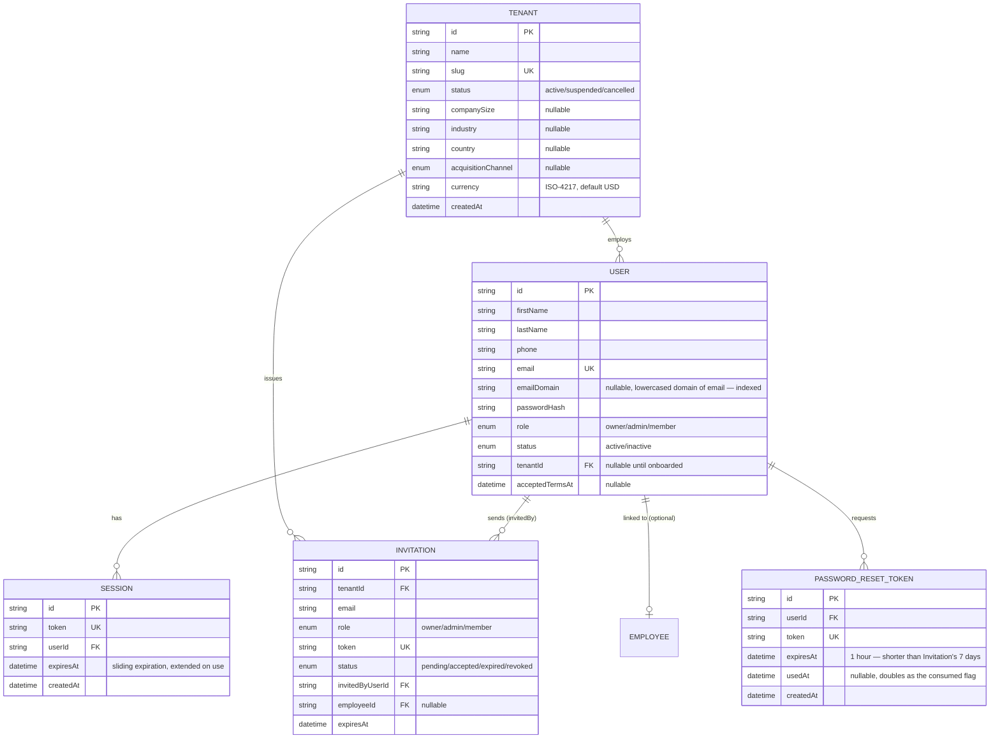
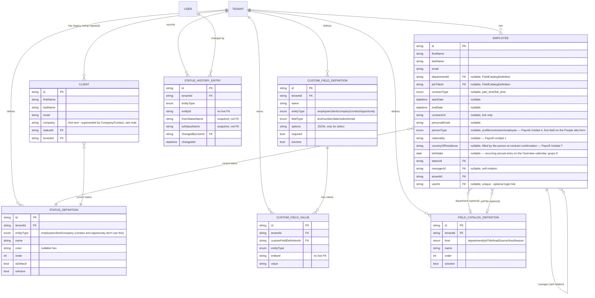
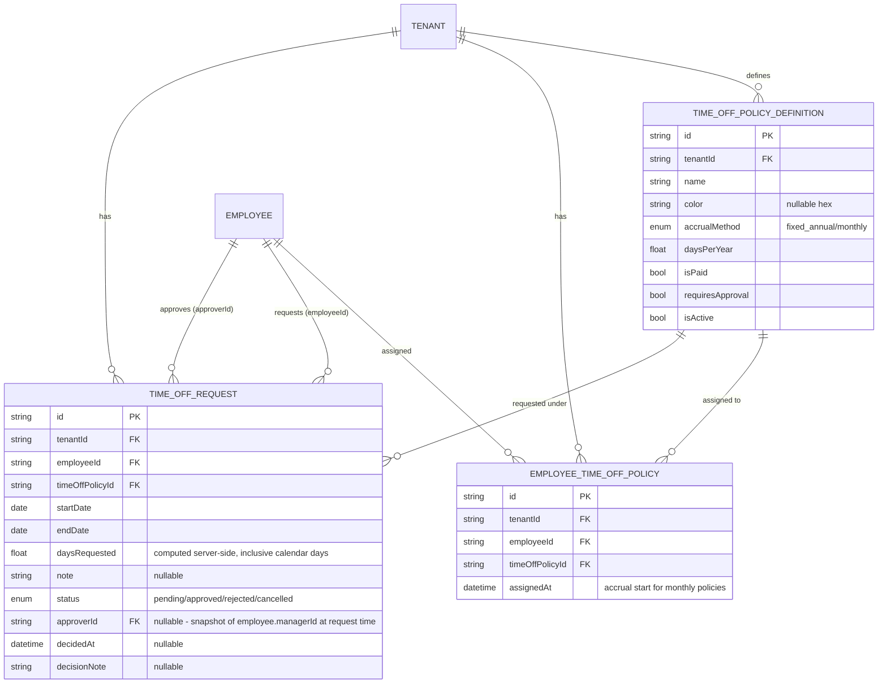
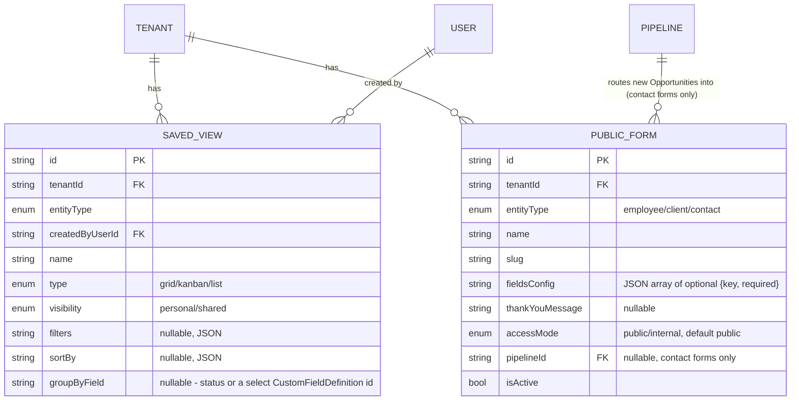
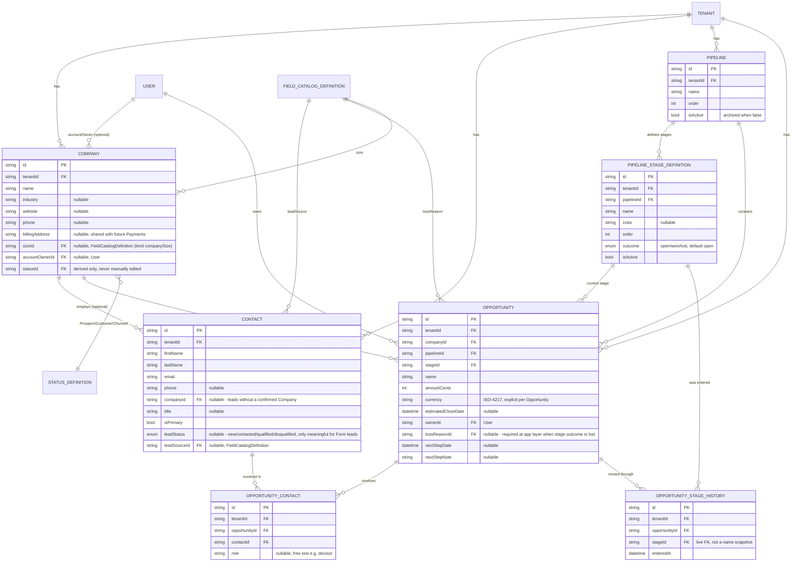
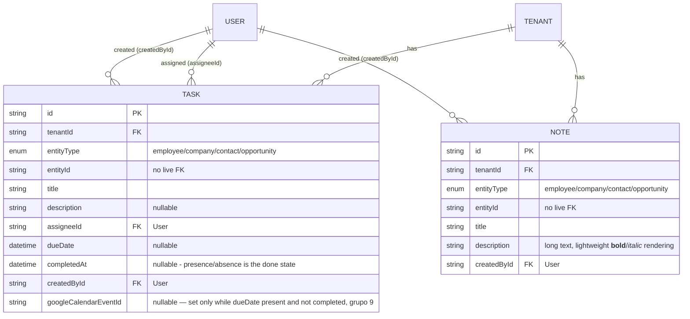
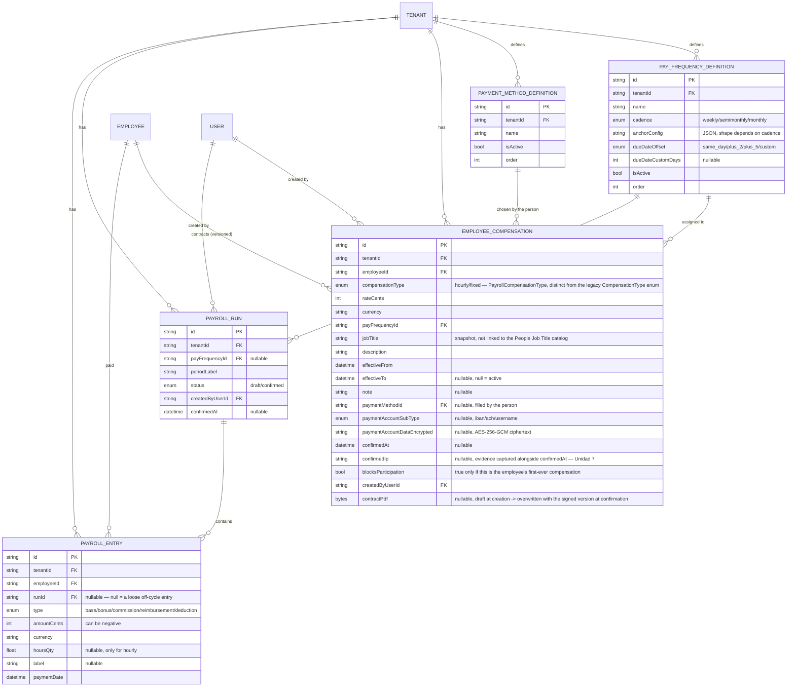
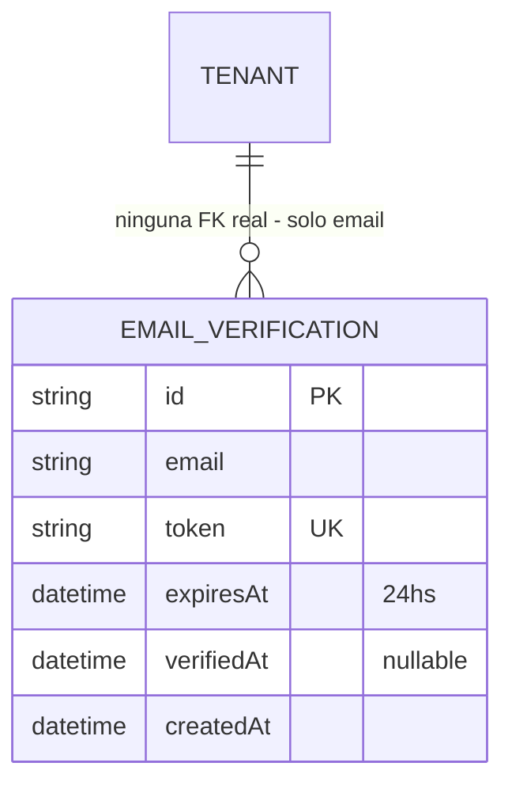
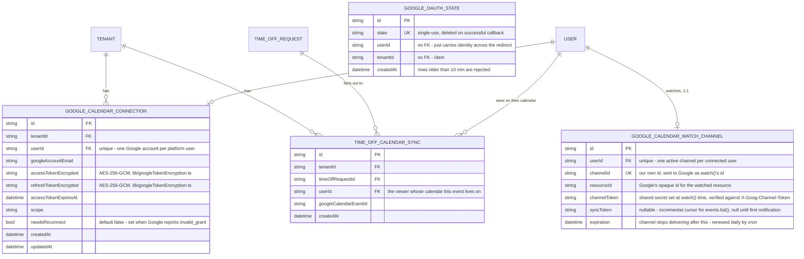

# Database Schema

- Última actualización: 2026-08-22 (Google Calendar sync + cumpleaños de empleados, solo local/sin pushear — ver grupo 9)
- Fuente de verdad real: `prisma/schema.prisma`. Este documento es una vista legible de ese archivo — si difieren, el `.prisma` manda. Regenerar este archivo cuando el schema cambie de forma significativa (modelo nuevo, relación nueva), no hace falta para cambios chicos (un campo opcional más, un índice).
- Todos los modelos son multi-tenant: casi todos tienen `tenantId` directo (no derivado por join), y el aislamiento entre tenants se verifica en el código de cada endpoint (ownership check), no solo por FK — ver `docs/current-process-flow.md` para el patrón de verificación.

## Cómo leer los diagramas

Se dividen en grupos por área funcional, no uno solo gigante, para que sean legibles:

1. **Identidad y acceso** — Tenant, User, Session, Invitation.
2. **HR core** — Employee, Client (legado, ver nota abajo), catálogos configurables (Status, Custom Fields, Field Catalog).
3. **Time Off** — políticas, asignación por empleado, solicitudes.
4. **Vistas y formularios** — SavedView, PublicForm.
5. **Sales / Clients redesign** — Company, Contact, Pipeline, Opportunity y su historial.
6. **Tasks & Notes (cross-entity)** — Task, Note, adjuntables a Employee/Company/Contact/Opportunity.
7. **Payroll** — PayFrequencyDefinition, PaymentMethodDefinition, EmployeeCompensation, PayrollRun, PayrollEntry.
8. **Tenant Signup + Subscription Plans** — EmailVerification, y los campos nuevos de Tenant (plan/trial/gracia/precio congelado).
9. **Google Calendar sync + cumpleaños** — GoogleCalendarConnection, GoogleOAuthState, y los campos nuevos de Employee/Task/TimeOffRequest.

## 1. Identidad y acceso



Notas:
- `User.tenantId` es nullable — un `User` sin tenant existe momentáneamente solo en el flujo de aceptar invitación (`POST /api/auth/register` crea el usuario "suelto", y `POST /api/invitations/:token/accept` lo adjunta al tenant en la misma operación).
- `Invitation` no fuerza un solo uso por email — el guardrail real (no invitar a alguien que ya pertenece a un tenant) vive en `createInvitation`, no en el schema.
- `Session.expiresAt` es **expiración deslizante**: cada uso válido la extiende (solo si falta menos de 1 día, para no pagar el costo de un `UPDATE` en cada request autenticado). Cambiar la propia contraseña revoca todas las demás sesiones del usuario. Se agregó vía migración segura (nullable → backfill de las sesiones existentes → `NOT NULL`), documentada en `docs/tareas/semana-2026-07-21.md`.
- `Tenant.companySize`/`industry`/`country`/`acquisitionChannel` y `User.acceptedTermsAt` son campos del formulario de Sign Up ampliado (2026-07-22) — todos nullable, no retroactivos.
- **`User.emailDomain` (2026-08-18)**: agregado para que `checkEmailDomainNotAlreadyRegistered` (`tenantService.ts`) haga un lookup indexado en vez de un scan de toda la tabla con `email: {endsWith: '@dominio'}` (Postgres no puede usar un índice btree para eso). Mismo patrón seguro que `Session.expiresAt` arriba: columna nullable, seteada en cada `user.create` desde el 2026-08-18 en adelante (`registerTenantWithOwner`, `registerUser`, `contractConfirmationService`), y un backfill (`scripts/backfill-user-email-domain.ts`) para las filas anteriores — correrlo una vez después del `prisma db push` que agrega la columna, contra **las dos** bases (ver la regla de proceso en `docs/general/tareas-desarrollo.md`).
- **`PasswordResetToken` ("¿olvidaste tu contraseña?", 2026-08-09)**: mismo patrón que `Invitation` (token random, ventana de expiración, resuelto en un solo request), pero con un flag `usedAt` en vez de un enum `status` — un reset token solo tiene dos estados posibles (sin usar/usado), no necesita `pending/expired/revoked`. `POST /api/auth/forgot-password` nunca revela si el email existe (misma respuesta genérica siempre, sin importar el resultado — evita enumeration); pedir un reset nuevo invalida (`usedAt`) cualquier token anterior sin usar de esa persona. Al confirmar el reset (`POST /api/auth/reset-password`) se borran **todas** las sesiones existentes del usuario (a diferencia de `changeOwnPassword`, que preserva la sesión que hizo el cambio) y se crea una sesión nueva — la persona queda logueada, pero cualquier sesión vieja (robada o no) muere.

## 2. HR core



Notas — patrones deliberados que se repiten en todo el schema:
- **`entityType` genérico en vez de una FK por módulo**: tanto `CustomFieldValue` como `StatusDefinition`/`StatusHistoryEntry` usan `tenantId` + `entityType` + `entityId` (sin FK real de Prisma — se verifica en código) en vez de columnas `employeeId`/`clientId`/`companyId` separadas. Un módulo nuevo nunca requiere una migración de schema para heredar custom fields o catálogo de status — solo agregar el valor de enum correspondiente. `entityType` (`EntityType` enum) hoy tiene 5 valores: `employee`, `client`, `company`, `contact`, `opportunity` — los últimos 3 se agregaron para el rediseño de Clients (ver grupo 5).
- **Historial por snapshot, no por FK viva**: `StatusHistoryEntry.fromStatusName`/`toStatusName` guardan el *nombre* del status al momento del cambio, no una referencia a `StatusDefinition`. Si alguien renombra un status después, el historial viejo no se reescribe retroactivamente. Contraste deliberado: `OpportunityStageHistory` (grupo 5) sí usa una FK viva — ver esa sección.
- **`FieldCatalogDefinition` — catálogo genérico compartido**, distinto de `StatusDefinition` a propósito: nace para `Employee.department`/`jobTitleId` (ambos eran texto libre, migrados a FK vía el patrón de migración segura — push aditivo → backfill → endurecer a requerido/borrar columna vieja), y se reutilizó para `Contact.leadSourceId` y `Opportunity.lossReasonId` (`kind: 'leadSource'`/`'lossReason'`) en vez de crear 2 tablas nuevas. `Status` deliberadamente **no** se unificó en este mecanismo — es una feature más pesada (agrupamiento de Kanban, historial, guardrail de `isDefault`, sembrado automático por tenant) y migrarla hubiera sido riesgo real de regresión por poco beneficio.
- `Employee.managerId` es una relación auto-referencial — ver `wouldCreateManagerCycle` en `employeeService.ts` para la validación anti-ciclo que la acompaña.
- **`Client` — modelo legado, en proceso de reemplazo**: ver grupo 5 (Sales / Clients redesign) para el reemplazo (`Company` + `Contact`). `Client` sigue totalmente funcional (rutas, UI, custom fields) en paralelo mientras dura la migración — no se tocó ni se va a tocar hasta un corte deliberado y aprobado por separado. Todo tenant nuevo sigue sembrando su catálogo de `StatusDefinition` por defecto (Employee: Active/Inactive/Pending — Client: Prospect/Active/Inactive/Archived — Company: Prospect/Customer/Churned).

## 3. Time Off

Renombrado de "PTO" a "Time Off" en el schema (`PtoPolicyDefinition`→`TimeOffPolicyDefinition`, etc.) — el nombre visible en la UI y en la documentación de producto ya era "Time Off" desde el principio, el schema tenía el nombre viejo.



Notas:
- `EmployeeTimeOffPolicy` es la tabla de unión muchos-a-muchos — `@@unique([employeeId, timeOffPolicyId])` evita duplicados.
- `TimeOffRequest.approverId` se fija **al momento de crear la solicitud**, copiando el `managerId` del empleado en ese instante — snapshot, no se recalcula si el manager cambia después. Sin manager asignado, cualquier owner/admin puede decidir como fallback.
- El balance de días (asignado/usado/pendiente/restante) **no se guarda en ninguna tabla** — se calcula al vuelo (`timeOffBalanceService.ts`).
- Si `requiresApproval` es `false`, la solicitud nace directo en `status: approved`.
- El tag visual de "de licencia" en la fila del empleado se deriva en cada `GET /api/hr/employees`, no es una columna.
- Sistema completo (7/7 piezas: jerarquía, políticas, asignación, solicitud/aprobación, balance, calendario, tag visual) desde 2026-07-14.
- **2026-08-23**: un `TimeOffRequest` aprobado se sincroniza a Google Calendar — no como campo propio, sino vía `TimeOffCalendarSync` (grupo 9), porque un mismo Time Off aparece en el calendario de **todos** los usuarios conectados del tenant, no solo el de la persona que se lo toma (mismo criterio que la vista compartida del Overview).

## 4. Vistas y formularios



Notas:
- `SavedView`: solo owner/admin crean vistas `shared`; borrar una vista `personal` es exclusivo de quien la creó. Mover una card en Kanban reutiliza los `PATCH` ya existentes de cada entidad (por `statusId` o custom field), sin endpoints nuevos.
- `PublicForm`: conceptualmente "Form" en el rediseño de Clients (ya no exclusivamente público desde que existe `accessMode`), pero **se mantuvo el nombre de tabla** `PublicForm` — un rename real por `db push` es riesgoso sin herramienta de migraciones formal, sin beneficio funcional. `accessMode: 'internal'` está en el schema pero sin flujo de acceso autenticado construido todavía — `findActivePublicForm` falla cerrado (nunca sirve un form `internal` en la ruta pública anónima).
- `PublicForm.pipelineId` (nuevo, rediseño de Clients): solo aplica a `entityType: 'contact'`. Si está seteado, un submit que matchea o crea una Company también crea una Opportunity en el primer stage activo de ese Pipeline — ver grupo 5.
- `fieldsConfig` nunca incluye firstName/lastName/email (siempre presentes y requeridos) — solo campos opcionales (`department`/`company` para Employee/Client, o `cf:<id>` para custom fields; los forms de Contact no tienen un campo "hardcodeado" equivalente, porque el matching de Company es automático por dominio de email, no cargado a mano).

## 5. Sales / Clients redesign (Company, Contact, Pipeline, Opportunity)

Reemplaza gradualmente al `Client` legado del grupo 2 (ver ahí la nota de convivencia). Spec completo en `docs/tareas-desarrollo.md` líneas ~389-411; construido pieza por pieza (11 unidades) 2026-07-27, cada una commiteada y pusheada a `staging` por separado.



Notas — decisiones deliberadas de este rediseño:
- **`PipelineStageDefinition.outcome` (`open`/`won`/`lost`)** es la pieza que no estaba en el spec original — necesaria porque los nombres de stage son renombrables por tenant, así que el sistema no puede detectar "ganado"/"perdido" comparando strings. Aprobado explícitamente con el usuario antes de construir.
- **Won → Customer, automático**: cuando un `Opportunity.stageId` cambia a un stage con `outcome: 'won'`, `maybeAdvanceCompanyToCustomer` busca el `StatusDefinition` `name: 'Customer'` activo de `entityType: 'company'` del tenant y actualiza `Company.statusId` — best-effort, no rompe si el tenant renombró/desactivó ese status. **Churned no tiene trigger automático todavía** — el spec lo liga a vencimiento de un `Contract` sin renovación, y `Contract` no existe como entidad en este alcance; `Churned` queda como valor de status seleccionable sin disparador propio, gap conocido y aceptado.
- **`OpportunityStageHistory.stageId` es una FK viva**, a diferencia de `StatusHistoryEntry` (que snapshotea el *nombre*) — decisión explícita del spec, para poder calcular tiempo-en-stage más adelante uniendo contra el `PipelineStageDefinition` real (color/order/outcome), no solo un texto histórico.
- **Pipeline archivado**: sus Opportunities quedan visibles en modo solo lectura (no editables hasta desarchivar, validado también en el backend como capa de seguridad ante llamadas directas a la API) pero siguen contando en reporting histórico. Desaparece de cualquier selector de creación.
- **`Contact.companyId` es opcional a propósito** — un lead capturado por un Form público puede no matchear ninguna Company todavía (dominio de email genérico o desconocido). Bloquear la conversión a Opportunity sin `companyId` es la regla actual; la calificación de leads de mayor volumen (ver `docs/tareas-desarrollo.md`) está explícitamente pospuesta hasta que haya evidencia real de volumen.
- **Matching de Company al hacer submit de un Form de tipo `contact`** (`matchOrCreateCompanyForContact`, `publicFormService.ts`): busca un `Contact` existente del tenant con el mismo dominio de email que ya tenga `companyId` y reutiliza esa Company; dominios genéricos (`GENERIC_EMAIL_DOMAINS`, la misma lista usada por el validador de dominio duplicado del Sign Up) o sin match → `Contact` se crea sin Company (`companyId: null`); dominio específico sin match → crea una `Company` nueva en estado `Prospect`, nombre derivado del dominio. Nunca sobreescribe una Company existente con datos del form.
- **`Opportunity.amountCents` + `currency` es explícito por Opportunity**, no el `Tenant.currency` que usa la compensación de Employee — deliberado, cada deal puede cerrar en una moneda distinta.
- `deleteOpportunity` borra `OpportunityStageHistory` + `OpportunityContact` + la `Opportunity` dentro de una `$transaction` — ninguna de esas FKs tiene `onDelete: Cascade`, así que un `delete` simple fallaría en cuanto existiera historial.
- **Migración de datos (`Client` → `Company`/`Contact`)**: script idempotente `scripts/backfill-clients-to-companies-contacts.ts` — agrupa `Client.company` (texto libre) por nombre normalizado (trim + espacios colapsados + case-insensitive) dentro de cada tenant, crea/reutiliza una `Company` por grupo, y un `Contact` por `Client` (createdAt original preservado, salteando por email si ya existe). El status de `Client` (Prospect/Active/Inactive/Archived) mapea a Company (`Prospect→Prospect`, `Active→Customer`, `Inactive`/`Archived→Churned`; "el más avanzado gana" cuando varios `Client` comparten nombre de company). De paso descubrió y corrigió un bug real: ningún tenant creado antes de este rediseño tenía filas `StatusDefinition` de `entityType: 'company'` (el sembrado solo corre al crear un tenant nuevo) — sin eso, `Company` no se podía crear para *ningún* tenant preexistente, no solo los que tenían `Client`. El script las siembra retroactivamente para cualquier tenant que no las tenga. **Corrido y verificado en staging (21 Companies/21 Contacts, re-corrida confirmó idempotencia). Todavía no corrido contra producción** — bloqueado hasta que el usuario revise staging y dé el visto bueno (ver `docs/tareas-desarrollo.md`).
- El `Client` legado (rutas, UI, custom fields) sigue intacto en paralelo — este es un backfill aditivo, no un corte. El corte (ocultar/borrar `Client`) es una unidad futura separada, deliberadamente no construida todavía.
- **`Company.size` → `sizeId` (2026-07-30, Checkpoint E)**: pasó de texto libre a FK a `FieldCatalogDefinition` (`kind: 'companySize'`), mismo mecanismo que `department`/`jobTitle`/`leadSource`/`lossReason` — gestionable desde el header de la columna "Size" en `CompaniesPage.tsx`. Migrado con el patrón seguro (nullable → backfill → requerido/borrar columna vieja); `staging` no tenía ninguna Company con `size` cargado al migrar, así que el backfill no tuvo nada que mover.
- **Company creación — Contact obligatorio (2026-07-30, Checkpoint E)**: `createCompany` ahora exige un Contact en la misma transacción — uno nuevo (`firstName`/`lastName`/`email`) o uno existente (`contactId`, usado por el flujo de "crear Company al vuelo" desde `ContactDetailModal`). No es una restricción a nivel de base de datos, se aplica en `companyService.ts`.
- **Delete de Contact/Company — antes crasheaba con Opportunities vinculadas** (bug real encontrado por el usuario, 2026-07-30): `OpportunityContact` no tiene `onDelete: Cascade`, así que un `delete` simple de Contact o Company con Opportunities vinculadas fallaba con un error crudo de constraint. `deleteContact`/`deleteCompany` ahora aceptan un flag opcional (`deleteLinkedOpportunities`) que, si viene en `true`, borra las Opportunities vinculadas primero (reusando `deleteOpportunity`); sin el flag, siguen bloqueando con un mensaje legible. Borrar una Company **desvincula** sus Contacts (`companyId: null`), nunca los borra.

## 6. Tasks & Notes (cross-entity)

Genéricos, adjuntables a Employee/Company/Contact/Opportunity (no a `Client`, en vías de discontinuarse) vía el mismo patrón `tenantId`+`entityType`+`entityId` que `CustomFieldValue`/`StatusHistoryEntry` — sin FK real de Prisma, verificado en código (`src/modules/crossModule/entityLookup.ts`, compartido por los dos módulos para que la lista de entity types soportados y el chequeo de tenant no diverjan entre uno y otro). Construidos 2026-07-29/30, todavía solo en `staging`.



Notas:
- **Permisos abiertos a cualquier rol del tenant** (no gateado por `canCreateHr`/`canManageCustomFields` como Employee/Opportunity) — confirmado con el usuario 2026-07-29: Tasks es una checklist operativa compartida, Notes un registro compartido, ninguno dato sensible. Anotado para revisar cuando exista el sistema de roles custom (Tier 5).
- `Task` tiene asignado + fecha límite + estado completado (es un to-do); `Note` no tiene ninguno de los tres — es un registro, no una acción pendiente.
- **2026-08-22**: `listTasksForCalendar`/`listMyTasks` (los dos endpoints que alimentan el Overview) excluyen `completedAt != null` server-side — una tarea completada sigue existiendo (se ve en `EntityTasksList`, el tab de la propia entidad) pero desaparece del calendario y del widget "My tasks". `Task.googleCalendarEventId` — ver grupo 9.
- **`Note.title`/`description`** se llamaban `header`/`body` hasta el 2026-07-30 — renombrados para que coincidan con `Task.title`/`description` (consistencia entre los dos módulos gemelos). Migrado con el patrón seguro (nullable → backfill → requerido/borrar columnas viejas); preservó la única Note real que ya existía en `staging` (creada por el usuario probando la app).
- `description` admite un subconjunto chico de markdown (**bold**, *italic*) renderizado a elementos React reales (`frontend/src/lib/lightMarkdown.tsx`, sin `dangerouslySetInnerHTML`) — no una librería de markdown completa, no se justificaba para "resaltar partes" nada más.
- `Opportunity.nextStepDate`/`nextStepNote` (grupo 5) tienen un script de backfill a `Task` (`scripts/backfill-opportunity-nextstep-to-tasks.ts`, idempotente) — corrido en `staging`, 0 Opportunities con next step cargado todavía ahí, así que no creó nada. Las columnas viejas de `Opportunity` no se tocaron.
- En el frontend, ambos se consumen a través de `EntityTasksList`/`EntityNotesList` — un componente compartido literal por los 4 paneles de detalle (Employee/Company/Contact/Opportunity), no 4 implementaciones separadas. El compose (crear/editar) está siempre expandido en la columna derecha del panel de detalle (`DetailSidebar.tsx`), no detrás de un popover — cambiado 2026-07-30, antes abría un `Popover` al hacer click en una fila fantasma.

## 7. Payroll

Spec completo en `docs/spec-payroll.md` (v2, 21 unidades) — tercer intento, los dos anteriores se
revirtieron por completo (git log tiene el detalle; `docs/tareas-desarrollo.md` y
`docs/features-overview.md` resumen el incidente). Completas hasta Unidad 7 (schema, cifrado,
catálogo de políticas de pago, rename a People + `personType`, alta con contrato inicial,
invitación específica, y la pantalla pública de confirmación de contrato) — verificado de punta a
punta con Playwright: alta de un Contractor → invitación automática → confirmación real (contraseña,
país, IBAN) → `User` creado y logueado → datos de cuenta desencriptados coinciden con lo ingresado.



Notas:
- **`EmployeeCompensation` es versionado, nunca un campo plano en `Employee`** — una suba de sueldo
  o un cambio de frecuencia crea un registro nuevo en vez de sobreescribir. La regla "un solo
  registro `effectiveTo: null` por empleado" se aplica en `employeeCompensationService` (a
  construirse en Unidad 2+), no a nivel de base de datos — mismo patrón que `StatusDefinition.isDefault`.
- **`PayFrequencyDefinition`/`PaymentMethodDefinition` son catálogos configurables por tenant**, no
  enums fijos — mismo precedente que `StatusDefinition`/`TimeOffPolicyDefinition`.
- **`PayrollCompensationType` (`hourly`/`fixed`) reemplaza al `CompensationType` legado**
  (`hourly`/`monthly`) — nombre distinto porque el value set cambia (`fixed` en vez de `monthly`).
- **`Employee.hourlyRateCents`/`monthlyRateCents`/`compensationType` retirados por completo (Unidad
  4, 2026-08-07)**: `scripts/backfill-legacy-employee-compensation.ts` copió cualquier dato ya
  cargado (4 registros en `staging`, todos de prueba) a un `EmployeeCompensation` inicial —
  `confirmedAt`/`blocksParticipation: false` forzados en la migración para no bloquear a gente que
  ya tenía compensación real, a diferencia de un contrato nuevo genuino (Unidad 9). Aplicado el
  patrón completo de migración segura (aditivo → backfill → verificar con query directa →
  destructivo, este último con confirmación explícita del usuario dado que Prisma no permite un
  `db push` parcial): las 3 columnas y el enum `CompensationType` **ya no existen en la base**, no
  solo en el código.
- **Restos de un intento anterior**: al aplicar esta unidad se encontraron 4 tablas huérfanas en
  `staging` (mismos nombres, forma de columnas vieja e incompatible) dejadas por un intento de
  Payroll revertido por completo del lado del código — un `git revert` no deshace un `prisma db push`
  ya aplicado. Se borraron antes de aplicar el schema nuevo.
- **Gotcha de ruteo (Unidad 7)**: `GET /api/public/contract-confirmation/:token` colisionaba con el
  catch-all genérico `GET /api/public/:tenantSlug/:formSlug` de Public Forms — misma forma de 2
  segmentos, y Express matchea por orden de registro, así que el que estaba registrado primero
  (Forms) se comía el request y devolvía siempre "Form not found". Fix: las rutas de Payroll se
  registraron *antes* que el catch-all en `src/routes/public.ts`, con un comentario explicando por
  qué el orden importa acá. Si se agrega un endpoint público nuevo bajo `/api/public/*` con 2
  segmentos de path, chequear este archivo primero.
- **En producción desde 2026-08-09.** El módulo se desarrolló completo en local (Unidades 1-21 +
  rondas de fixes) a pedido explícito del usuario 2026-08-07, y se promovió directo a `main` sin
  pasar por `staging` (también a pedido explícito). Producción no tenía ninguna tabla de este grupo
  ni el retiro de las columnas legacy de `Employee` — la migración completa (aditivo con un schema
  transicional → `scripts/backfill-payroll-catalogs.ts` → backfill de compensación legacy vía SQL
  crudo, 9 empleados de tenants de testing → verificar → destructivo con `--accept-data-loss`) se
  corrió a mano contra la base real, con conteos de tenants/empleados verificados iguales antes y
  después (126/234). Detalle completo en `docs/tareas-desarrollo.md`, entrada "Migración y deploy a
  producción (2026-08-09)".
- **`EmployeeCompensation.contractPdf` (2026-08-08, feedback del usuario)**: una sola columna que
  guarda el PDF del contrato tal cual existe en cada momento — generado como borrador al crear el
  contrato (`employeeCompensationService.createCompensation`, vía `contractPdfService.renderContractPdf`)
  y **sobrescrito** con la versión firmada (con `confirmedAt`/`confirmedIp` ya incluidos en el propio
  documento) al confirmar (`contractConfirmationService.confirmContract`) — nunca dos columnas
  separadas, la que corresponde según el estado. El borrador va adjunto al email de invitación
  (`mailer.sendInvitationEmail` ahora acepta `attachments`); al firmar se dispara un email nuevo
  (`mailer.sendContractSignedEmail`) al firmante con copia al owner del tenant y a quien cargó el
  contrato (`createdByUserId`). `POST /api/hr/employees/:employeeId/resend-contract` (owner-only)
  reenvía lo que sea que esté guardado ahora mismo, sin regenerar nada — si el borrador ya venció su
  invitación (7 días), emite una nueva antes de reenviar. `GET /api/hr/employees/:employeeId/contract-pdf`
  sirve el PDF guardado para "View contract" en el panel de People (reusa `PayslipPreviewModal` con
  props generalizados, no es un componente nuevo).

## 8. Tenant Signup + Subscription Plans

Specs completos en `docs/spec-tenant-signup.md` y `docs/spec-subscription-plans.md` (v1,
2026-08-13, breakdown en `docs/task-breakdown-signup-plans.md`). **Solo en local — sin
pushear a `staging` ni `main` todavía**, a la espera de que el usuario lo pruebe. Reemplaza el
registro de un solo paso (`RegisterPage.tsx` → `POST /api/tenants/register` directo, sin
verificar el email) por: email → verificación por link → survey de 3 pasos (Company/You/
Security) → cuenta creada → `/overview`, con `PlansModal` (Starter/Growth/Free Trial)
abriéndose una sola vez, automáticamente, encima de esa pantalla — **corregido 2026-08-13**:
la primera implementación lo hizo una ruta (`/plans`) que bloqueaba la navegación hasta elegir
un plan; Alejandro corrigió con el mockup real aprobado (`subscription-plans-mockup.html`,
pegado en el chat, nunca existió como archivo en el repo) — es un modal descartable, no un
gate, porque el trial ya arranca en el registro sin importar si se elige plan.



Notas:
- **`EmailVerification` no tiene FK a `Tenant`/`User`** — existe *antes* de que cualquiera de
  los dos se cree (Screen 1, antes de empezar el survey). `registerTenantWithOwner` la valida
  (verificada, no vencida, email coincide) y la borra recién al final, justo antes de la
  transacción de creación — a propósito, no antes: si se consumiera apenas se valida y después
  fallara otro chequeo (nombre de tenant repetido, dominio bloqueado), la persona se quedaría
  sin token válido por una falla que no tenía nada que ver con su email.
- **`Tenant` gana 5 columnas** (todas nullable/aditivas, sin migración destructiva):
  `plan` (`PlanTier?`), `trialEndsAt`/`gracePeriodEndsAt` (`DateTime?`), `lockedPriceCents`/
  `lockedPriceSetAt`. `trialEndsAt` se setea una sola vez, en `registerTenantWithOwner`
  (`now + 15 días`) — elegir/cambiar de plan en `/plans` nunca lo vuelve a tocar.
  `lockedPriceCents` es el precio que un tenant paga aunque el precio de lista cambie después
  (tabla de precios server-side en `planService.ts`, nunca confiar en un precio del cliente).
- **`TenantStatus` gana `trialing`/`past_due`** (además de `active`/`suspended`/`cancelled` ya
  existentes). Máquina de estados: `trialing` → (vence `trialEndsAt`) → `past_due`
  (`gracePeriodEndsAt = trialEndsAt + 14 días`, acceso completo, solo banner) → (vence
  `gracePeriodEndsAt`) → `suspended`. Corrida por `planTransitionService.runPlanTransitions()`,
  disparada por un Vercel Cron nuevo (`vercel.json` → `/api/internal/plan-transitions/run`,
  1 vez/día) — no existía ningún mecanismo de cron en el proyecto antes de esto.
- **`checkEmailDomainNotAlreadyRegistered`** (extraído de `registerTenantWithOwner` a
  `tenantService.ts`, reusado por `emailVerificationService.ts`) ahora excluye tenants
  `cancelled` del match en vez de solo permitir `active` — antes de este cambio, un tenant
  `trialing`/`past_due` (que no existían como estados) no aplicaba; ahora sí bloquean un
  dominio duplicado igual que `active`, y solo `cancelled` (compañía que se fue) no bloquea.
- **`User.jobFunction`** (`JobFunction?`, nuevo enum) — "tu rol en la empresa" del survey
  (Screen 3b), deliberadamente no reusa `UserRole` (que es el enum de permisos owner/admin/
  member).
- **Sin enforcement de acceso para `suspended` todavía** — un tenant suspendido sigue
  técnicamente accesible hoy (nada en el código bloquea requests por `tenant.status`), fuera de
  alcance de este spec (ver "Qué falta" abajo).

## 9. Google Calendar sync + cumpleaños

Pedido por Alejandro 2026-08-22: notificaciones de eventos de la plataforma vía Google Calendar
(sync unidireccional Northstack → Google, las notificaciones las da el propio Google, no se
construyó ningún sistema de notificaciones in-app), cumpleaños de empleados visibles en el
Overview, y tareas completadas ocultas del Overview (esto último no toca el schema — ver grupo 6).
Primer OAuth de toda la app — no existía ninguno antes. **Solo en local — sin pushear a `staging`
ni `main` todavía**, a la espera de credenciales reales de Google Cloud
(`GOOGLE_CALENDAR_CLIENT_SECRET`/`REDIRECT_URI`) que Alejandro todavía no cargó.



Notas:
- **`GoogleCalendarConnection` es 1:1 con `User`** (`userId @unique`) — cada persona conecta su
  propia cuenta de Google, no hay conexión a nivel tenant/admin. Vive en Settings → Profile ("My
  account", visible a cualquier rol), no en la tile "Integrations" (Company, admin-only, todavía
  deshabilitada) de `SettingsHomePage.tsx` — esa es para integraciones a nivel tenant, algo distinto.
- **`GoogleOAuthState` existe solo por el round-trip stateless de Vercel**: `/connect` y
  `/callback` son dos invocaciones de función separadas sin memoria compartida, así que la
  identidad del usuario que inició el flujo tiene que sobrevivir en la base, no en memoria — mismo
  patrón lookup-por-token que `Session`. Fila de un solo uso, se borra en el callback exitoso.
- **Tokens encriptados con su propia key** (`GOOGLE_TOKEN_ENCRYPTION_KEY`), no la de Payroll
  (`PAYMENT_DATA_ENCRYPTION_KEY`) — mismo mecanismo AES-256-GCM (`lib/encryption.ts`), pero un key
  distinto por propósito, a propósito (ver comentario en `lib/encryption.ts`).
- **`needsReconnect`** se prende cuando Google devuelve `invalid_grant` (refresh token revocado) —
  la fila no se borra sola, así la UI puede mostrar "reconnect" con el email de la cuenta en vez de
  "not connected". Solo se borra de verdad al hacer click en "Disconnect".
- **Sync es reactivo, no hay reconciliación periódica**: `syncTaskCalendarEvent`/
  `syncTimeOffCalendarEvent` (`src/modules/integrations/googleCalendarSyncService.ts`) corren
  best-effort inmediatamente después de cada create/update/delete de Task o cada cambio de status
  de TimeOffRequest. Si alguien borra el evento a mano del lado de Google, no se recrea solo.
  `backfillCalendarSyncForUser` corre una sola vez, justo al conectar, para no dejar afuera lo que
  ya estaba pendiente antes de esa conexión (sync reactivo no mira para atrás).
- **Task es personal, Time Off es de todo el equipo — asimetría deliberada** (2026-08-23,
  corrección de Alejandro sobre el diseño original): un Task solo aparece en el calendario de su
  `assigneeId` (`Task.googleCalendarEventId`, 1 registro → 1 evento, grupo 6). Un Time Off
  aprobado, en cambio, aparece en el calendario de **todos** los usuarios conectados del tenant —
  mismo criterio que la vista compartida de Time Off en el Overview — por eso 1 `TimeOffRequest`
  puede generar N filas en `TimeOffCalendarSync` (una por cada `GoogleCalendarConnection` del
  tenant), no un solo `googleCalendarEventId` en el propio `TimeOffRequest`.
- **`Employee.birthdate`** (`DateTime? @db.Date`, grupo 2) — sin encriptar, mismo criterio que
  `startDate`/`endDate`/`nationality` (no es dato tan sensible como para justificar el mecanismo de
  `EmployeeCompensation`). Se muestra como evento anual recurrente (match por mes+día, año
  ignorado) en el calendario del Overview — **nunca se sincroniza a Google**, decisión explícita de
  Alejandro (2026-08-22) para mantener esto interno.
- **`GoogleCalendarWatchChannel` — sync inverso (Google → Northstack), solo Tasks** (2026-08-23,
  pedido explícito de Alejandro tras probar el sync unidireccional). Time Off queda afuera a
  propósito: al ser de todo el equipo, "quién puede editarlo de vuelta" no tiene una respuesta
  limpia. Un canal por usuario conectado (`userId @unique`), abierto al conectar
  (`src/modules/integrations/googleCalendarWatchService.ts`'s `openWatchChannelForUser`, llamado
  desde el callback de OAuth junto al backfill) y renovado a diario por el cron
  `/api/internal/google-calendar-channels/renew` (`vercel.json`) — los canales de Google no se
  renuevan in-place, solo se cierran y se abren de nuevo, por eso hace falta el cron en vez de
  fijar una fecha de vencimiento larga y listo. Las notificaciones de Google no traen datos, solo
  avisan "algo cambió" — `channelToken` es la única verificación de que la notificación es legítima
  (Google no firma el body como sí hacen Paddle/Mercado Pago), y `syncToken` es el cursor que
  permite pedirle a Google el diff real vía `events.list`. Solo se tocan Tasks cuyo
  `googleCalendarEventId` ya estaba trackeado — nunca se lee el calendario completo del usuario.
  **No se puede probar contra `localhost`** — Google no puede llegarle a una máquina local, así que
  esta pieza solo se verifica de punta a punta contra `staging`/producción.

## 10. Payments v1 — conexión con Stripe

Pedido por Alejandro 2026-08-26 (`docs/tareas/specpaymentsv1.md`), Units 1-4 completas y ya en
`main`. Cada tenant conecta su **propia** cuenta de Stripe (Restricted Key pegada a mano — Northstack
confirmó con el soporte de Stripe que OAuth/Connect requiere una entidad legal tipo LLC que
Northstack no tiene todavía, mismo bloqueo ya anotado para su propia suscripción vía Paddle/Mercado
Pago). Solo lectura: nada acá crea charges/invoices/subscriptions.

Unit 4 (notificaciones proactivas) se **rediseñó 2026-08-28** (ver QA-49/QA-50 en `Tareas-QA.md`):
originalmente un webhook que cada tenant tenía que registrar a mano en su dashboard de Stripe
(URL + signing secret) — reemplazado por un cron de 2x/día (`src/routes/internal.ts`,
`runStripeEventPolling`) que hace polling de `GET /v1/events` con la misma Restricted Key. Cero
pasos manuales extra para el tenant; `StripeConnection.webhookSigningSecretEncrypted` se sacó del
schema, se agregó `lastEventPollAt` (cursor del cron, arranca en `connectedAt` en el primer poll).

```mermaid
erDiagram
    TENANT ||--o| STRIPE_CONNECTION : "has, 1:1"
    USER ||--o{ STRIPE_CONNECTION : "connected by"

    STRIPE_CONNECTION {
        string id PK
        string tenantId FK UK "one connection per tenant"
        string apiKeyEncrypted "AES-256-GCM, lib/stripeEncryption.ts"
        string apiKeyMode "'test' | 'live', detected from the key's own prefix"
        string stripeAccountId "nullable - GET /account can 401 for a scoped Restricted Key"
        string webhookSigningSecretEncrypted "nullable - set in a separate step, AES-256-GCM"
        string connectedByUserId FK
        datetime connectedAt
        datetime disconnectedAt "nullable - soft, row survives a disconnect"
        bool needsAttention "default false - flips true when Stripe rejects the stored key"
    }
```

Notas:
- **1:1 con `Tenant`** (`tenantId @unique`) — a diferencia de `GoogleCalendarConnection` (1:1 con
  `User`), esta es una conexión a nivel tenant: cualquier owner ve/gestiona la misma, no una por
  persona.
- **Sin SDK de Stripe** — `src/lib/stripe.ts` es un wrapper propio (`fetch` + `crypto` nativos),
  mismo criterio ya establecido por `lib/paddle.ts`/`lib/mercadopago.ts` (evitar una dependencia
  nueva para un puñado de llamadas REST). A diferencia de esos dos, no hay una sola API key fija en
  una env var — cada tenant tiene la suya, así que toda función de `stripe.ts` la recibe como
  parámetro en vez de leerla de `process.env`.
- **Cifrado con key propia** (`STRIPE_TOKEN_ENCRYPTION_KEY`), ni la de Payroll
  (`PAYMENT_DATA_ENCRYPTION_KEY`) ni la de Google (`GOOGLE_TOKEN_ENCRYPTION_KEY`) — mismo mecanismo
  AES-256-GCM, un key por propósito (ver comentario en `lib/encryption.ts`).
- **`needsAttention`** — mismo espíritu que `GoogleCalendarConnection.needsReconnect`: se prende
  cuando Stripe rechaza la key guardada (401/403) en vez de que las lecturas fallen en silencio; la
  fila no se borra sola.
- **Soft disconnect** (`disconnectedAt`, no se borra la fila) — mismo criterio que
  `Contact.isActive`/`Opportunity.isActive` del rediseño de Sales v2: conserva el historial (quién
  conectó, cuándo) y deja que un reconnect futuro pase por el mismo `upsert()` que un connect nuevo,
  en vez de una segunda fila.
- **Permisos: owner-only** (`canManagePayments`, `permissionService.ts`) — la spec original decía
  "owner/admin, mismo criterio que Payroll", pero el gate real de Payroll es owner-only; Alejandro
  confirmó owner-only acá también, deliberadamente enrutado a través de este permiso nombrado (no un
  `role === 'owner'` inline en cada endpoint) para no tener que tocar cada call site cuando exista
  el sistema de roles custom (Tier 5).

**Unit 2 (2026-08-26, en `staging`) — lookup/matching Company↔Stripe Customer**: aditivo sobre
`Company` (grupo 5), sin modelo nuevo:

```
Company.stripeCustomerId          String?
Company.stripeCustomerMatchedVia  String?  // snapshot del email de Contact que produjo el match
```

Matching por email exacto de cada `Contact` activo de la Company contra Stripe (nunca por dominio),
confirmado manualmente (0/1/2+ resultados) — nunca automático. `stripeCustomerMatchedVia` guarda el
*email*, no una FK al Contact, mismo criterio que `StatusHistoryEntry` guardando un nombre en vez de
una FK viva (sobrevive a que ese Contact cambie de email o se desactive después).

**Unit 3 (2026-08-26, en `staging`) — visibilidad de pagos en vivo**: sin schema nuevo — todo se
resuelve en vivo contra la API de Stripe (decisión #7 de la spec, sin store histórico). El único
dato persistido es el vínculo de Unit 2 de arriba; refunds/failed/subscripciones se recalculan en
cada request.

**Unit 4 (2026-08-26, en `staging`) — webhook de notificaciones proactivas**: aditivo sobre
`enum NotificationType` (grupo de Sales v2/Notification), sin modelo nuevo — reusa `Notification`
tal cual ya existía:

```
NotificationType += stripe_charge_refunded | stripe_charge_failed | stripe_payment_failed
                  | stripe_subscription_past_due | stripe_subscription_canceled
```

`POST /api/webhooks/stripe/:tenantId` (en `src/routes/webhooks.ts`, junto a Paddle/Mercado Pago,
no en `/api/integrations/stripe/*` — ver decisión de la Unidad 1) resuelve la Company por
`stripeCustomerId` y crea una `Notification` (`entityType: 'company'`). Deliberadamente sin
`ProcessedWebhookEvent` (esa tabla es de Paddle/MP, `enum PaymentProvider` no ganó un valor
`stripe`) — el propio spec acepta el riesgo de una notificación duplicada ante un reintento de
Stripe, a cambio de no construir idempotencia pesada para una feature de solo-avisar.
`customer.subscription.updated` es el único evento con una guarda real: solo notifica si
`data.previous_attributes.status` está presente y el status nuevo es `past_due` — sin eso,
cualquier otro cambio a una subscription ya `past_due` re-notificaría en cada delivery.

## Enums

| Enum | Valores | Usado en |
|---|---|---|
| `UserRole` | `owner`, `admin`, `member` | `User.role`, `Invitation.role` |
| `UserStatus` | `active`, `inactive` | `User.status` |
| `TenantStatus` | `active`, `trialing`, `past_due`, `suspended`, `cancelled` | `Tenant.status` (`trialing`/`past_due` nuevos, Subscription Plans — grupo 8) |
| `AcquisitionChannel` | `organic`, `paid_ads`, `referral`, `content`, `outbound_sales`, `partnership`, `other` | `Tenant.acquisitionChannel` |
| `FieldType` | `text`, `number`, `date`, `select`, `email` | `CustomFieldDefinition.fieldType` |
| `ContractType` | `part_time`, `full_time` | `Employee.contractType` |
| `EntityType` | `employee`, `client`, `company`, `contact`, `opportunity` | `StatusDefinition`/`StatusHistoryEntry`/`CustomFieldDefinition`/`CustomFieldValue`/`SavedView`/`PublicForm`/`Task`/`Note`.entityType (Task/Note never use `client`) |
| `InvitationStatus` | `pending`, `accepted`, `expired`, `revoked` | `Invitation.status` |
| `TimeOffAccrualMethod` | `fixed_annual`, `monthly` | `TimeOffPolicyDefinition.accrualMethod` |
| `TimeOffRequestStatus` | `pending`, `approved`, `rejected`, `cancelled` | `TimeOffRequest.status` |
| `SavedViewType` | `grid`, `kanban`, `list` | `SavedView.type` |
| `SavedViewVisibility` | `personal`, `shared` | `SavedView.visibility` |
| `LeadStatus` | `new`, `contacted`, `qualified`, `disqualified` | `Contact.leadStatus` |
| `FormAccessMode` | `public`, `internal` | `PublicForm.accessMode` |
| `PipelineStageOutcome` | `open`, `won`, `lost` | `PipelineStageDefinition.outcome` |
| `CatalogKind` | `department`, `jobTitle`, `leadSource`, `lossReason`, `companySize` | `FieldCatalogDefinition.kind` |
| `PersonType` | `profile`, `contractor`, `employee` | `Employee.personType` |
| `PayFrequencyCadence` | `weekly`, `semimonthly`, `monthly` | `PayFrequencyDefinition.cadence` |
| `DueDateOffset` | `same_day`, `plus_2`, `plus_5`, `custom` | `PayFrequencyDefinition.dueDateOffset` |
| `PayrollCompensationType` | `hourly`, `fixed` | `EmployeeCompensation.compensationType` |
| `PaymentAccountSubType` | `iban`, `ach`, `username` | `EmployeeCompensation.paymentAccountSubType` |
| `PayrollRunStatus` | `draft`, `confirmed` | `PayrollRun.status` |
| `PayrollEntryType` | `base`, `bonus`, `commission`, `reimbursement`, `deduction` | `PayrollEntry.type` |
| `JobFunction` | `founder_ceo`, `hr`, `ops_finance`, `sales`, `other` | `User.jobFunction` (grupo 8) |
| `PlanTier` | `starter`, `growth`, `scale` | `Tenant.plan` (grupo 8) |

## Qué falta / deuda conocida

- **`Client` → `Company`/`Contact`**: backfill construido y verificado en staging, pendiente de correr contra producción (ver grupo 5 arriba) y luego un corte separado (ocultar/borrar el módulo `Client`) todavía sin construir ni programar.
- **`Contact.leadStatus`/calificación de leads sin volumen todavía**: no se construye hasta que haya evidencia real de volumen de Forms públicos (decisión explícita, no un olvido).
- **Automatizaciones de Opportunity** (email por cambio de stage, auto-asignación de owner, recordatorio de deal estancado): explícitamente pospuestas, dependen de que Opportunity/su historial maduren primero con uso real.
- **`Company.status: Churned`** no tiene disparador automático (depende de una entidad `Contract` que no existe en el alcance actual) — solo `Won → Customer` está automatizado hoy.
- No hay historial de valores previos de `CustomFieldValue` (pospuesto a propósito).
- `Session` sí expira (expiración deslizante) — no hace falta job de limpieza porque una sesión vencida simplemente deja de autenticar; no hay borrado físico de filas viejas todavía.
- El sistema de Time Off está completo (7/7 piezas).
- **Task/Note — permisos abiertos a cualquier rol** (ver grupo 6): revisar cuando exista el sistema de roles custom (Tier 5).
- **Activity — layout confirmado, sin construir**: el usuario confirmó 2026-07-30 que Activity entra como tab en el panel de detalle (junto a Notes/Tasks), pero sin ningún modelo/backend real todavía — el tab hoy es un placeholder de texto. El sistema de auditoría real (quién hizo qué y cuándo) sigue en Tier 5 ("cola larga").
- **Tasks/Notes/Company/Contact/Opportunity — nada de esto llegó a producción todavía**: todo el trabajo de esta sesión (2026-07-29/30, ver `docs/tareas-desarrollo.md`) está pusheado a `staging` únicamente, pendiente de que el usuario lo revise antes de promover a `main`.
- **Payroll — Unidades 1-4 solo en local/commits, nada pusheado a `staging` todavía** (a pedido del usuario, 2026-08-07): schema + cifrado (U1), catálogo de políticas de pago (U2, backend+frontend), rename a People + `personType` + retiro de la compensación legada (U4) — ver grupo 7 arriba para el detalle completo.
- **Tenant Signup + Subscription Plans — completo en local, nada pusheado todavía** (2026-08-13, ver grupo 8): a la espera de que el usuario lo pruebe en su entorno local antes de decidir si va a `staging`. Fuera de alcance de este spec, explícitamente pospuesto: integración real de Paddle/checkout, UI de "agregar método de pago", pantalla de autogestión de suscripción en `/settings`, y **cualquier enforcement de acceso para tenants `suspended`** (hoy el status cambia pero nada bloquea requests en base a él — un tenant suspendido sigue funcionando igual que uno activo).
- **Payments v1 — Units 1-4 construidas y en `staging`** (2026-08-26, ver grupo 10): conexión con Stripe, lookup/matching Company↔Customer, visibilidad de pagos en vivo (overview + panel en Company), y webhook de notificaciones proactivas. Nada de esto llegó a `main` todavía. No probado de punta a punta con una cuenta de Stripe real (sin credenciales en este entorno) — Unit 4 sí se verificó de punta a punta simulando deliveries reales de Stripe (firma HMAC calculada a mano contra un secret conocido), Units 1-3 solo con mocks/estados sin conexión — pendiente de que Alejandro pruebe el resto con su propia cuenta.
